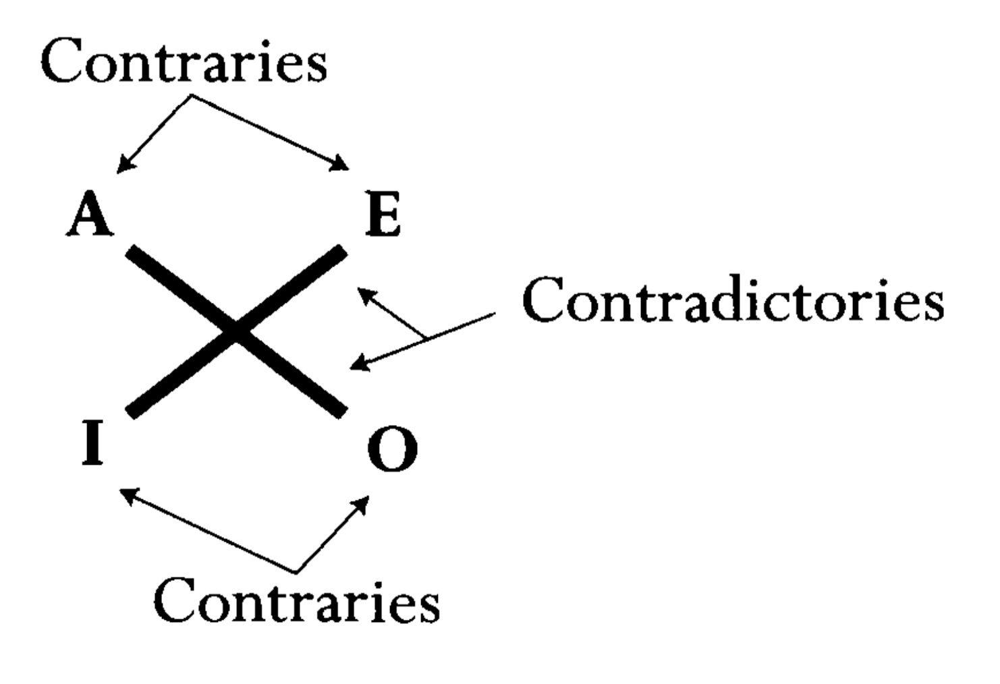
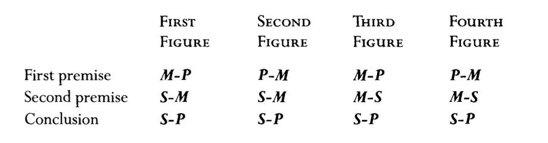
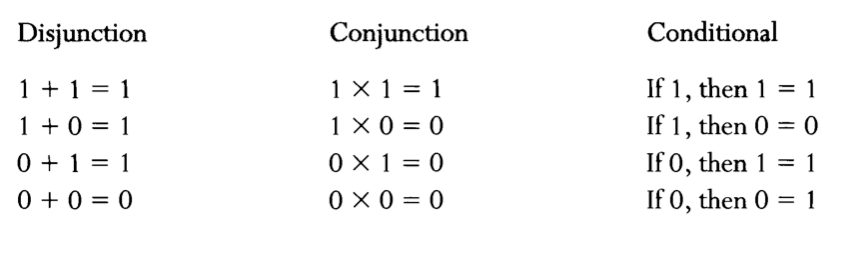

# Introdução e Histórico

## Somos seres lógicos?

As pessoas em geral assumem que a lógica é inata, como se fosse uma ferramenta com a qual viemos ao mundo. Como se nosso cérebro já viesse assim de fábrica. A gente sempre reclama de alguém, usando a expressão "não tem lógica", com base na presunção de que esta outra pessoa deveria saber disso de antemão, sem ter estudado qualquer outra coisa. Mas isso é *fake news!* Além de ser necessário, pois é muito comum nos perdermos na lógica dos argumentos que ouvimos ou lemos por aí, o estudo da lógica é interessante por dois principais motivos:

- A lógica possui suas armadilhas, das quais nem a melhor capacidade cognitiva humana consegue escapar; essas "cascas de banana retóricas" já eram conhecidas dos gregos há pelo menos uns 2200 anos – os primeiros que estudaram a lógica de forma sistemática;
- A aplicação da lógica na teoria da informação (Séculos XIX e XX) abriu o caminho para a revolução digital do Século XXI; inicialmente a formalização de ferramentas matemáticas imprescindíveis para nosso conhecimento, e a posterior digitalização da informação, deram início à era dos computadores.

Costumo pensar na lógica, para facilitar, como um *processo*. É mais fácil perceber como a lógica se aplica ao nosso dia-a-dia se prestarmos atenção aos passos que realizamos na mente durante nossa rotina. Pensa aí na situação de todo dia que se dá na sua cama, de manhã, no exato momento em que seu despertador toca (Duvido que você acorda sozinha(o), toda(o) serelepe, sem despertador!). Mais um dia de aulas e atividades, aquelas com as quais a docência maquiavélica do curso de Ciência da Computação insiste em te abarrotar. Já neste exato momento, você tem que tomar uma decisão, concorda? *Levantar ou não, eis a questão!?!* Então, você, Hamlet *millennial,* o que leva em consideração para tomar essa decisão? Você sabe que existem alguns **fatos** e você, a partir deles, pode **deduzir** certas **consequências. (**Eu não tive o entediante trabalho de colocar essas palavras em negrito à toa, hein? Elas devem ser guardadas aqui como palavras-chave.)

Por exemplo, você sabe que, se não levantar, não vai conseguir assistir àquela aula (fato), e se não assistir a ela, pode levar falta e, principalmente, perder o assunto que será discutido e se enrolar depois pra fazer a atividade, resultando em menores chances de ser aprovado (consequências)! Ao mesmo tempo, pode ser que o fato seja diferente, e naquele dia o assunto não seja tão importante, e neste caso as consequências de não se levantar e dormir mais não sejam tão danosas, o que pode fazer você se decidir por ficar na cama (ah, botão soneca!). Claro, pode ser que seu vizinho e sua furadeira implacável o façam decidir o oposto, mas aí são outros fatos e consequências em ação.

Ah sim, deixa eu avisar que estou fazendo aqui uma simplificação bastante grosseira da realidade. Estou assumindo que todas as decisões são tomadas a partir de um processo puramente *racional*, ignorando sensações ou qualquer outro estímulo emocional; afinal, a decisão de ficar na cama quase sempre é emocional, associada ao prazer de aproveitar a cama – qualquer psicólogo diria que *nenhuma* decisão nossa é puramente racional, apesar de muita gente esperta por aí achar que é o contrário.

Assumindo então um processo puramente racional, em que os fatos são considerados, junto com suas consequências calculadas, há um *processo lógico* nessa história. Por isso muitas definições de lógica a caracterizam como um processo de *tomada de decisão*. Se você usou lógica, você considerou as consequências dos fatos e os novos fatos gerados por esse processo, o que em geral chamamos de *dedução lógica* (na verdade, tem uma mistura aí, de dedução com indução, mas deixo essa discussão pra outro momento). Você vai ler isso nos livros com outros nomes: inferência, consequência, implicação, e por aí vai. Na dedução, chegamos a novos fatos a partir dos anteriores, utilizando alguns preceitos básicos de relação entre os fatos (mais sobre isso em breve), sem inventar nada novo – apenas baseado no que já se sabe.

Como escrevi lá em cima, é impossível achar que tomamos as decisões baseados apenas em lógica. Caso contrário, seríamos robôs. Mas a lógica faz parte das ferramentas básicas do *homo sapiens*; provavelmente é um traço que nos diferencia de outras espécies. Junto, claro, com a habilidade de utilizar a *linguagem*, pois sem ela não há dedução lógica.

> O surgimento de novas formas de pensar e se comunicar, entre 70 mil e 30 mil anos atrás, constitui a revolução cognitiva [...] Poderíamos chamar de mutações da árvore do conhecimento. Por que ocorreram no DNA do sapiens e não no DNA do neandertais? [...] questão de puro acaso.

*Sapiens, Yuval Noah Harari*

Agora vou ficar esperando você me achar chique por citar livros bacanas, certo?

## Lógica e Computação

Vamos continuar...já que falei de robô, é fácil relacionar o conceito de lógica à Ciência da Computação, tanto na teoria quanto na prática. Em termos teóricos, basta saber que *sem lógica não há matemática, e sem matemática não há computação*. Por exemplo, a lógica permite definir todas as estruturas matemáticas discretas (FMCC, hein?), que estão na base da ciência que conhecemos hoje como computação. (Lembrando, Alan Turing Cumberbatch praticamente fundou a computação a partir da resolução de um problema de matemática.) E a lógica dedutiva é a base das definições e provas necessárias para a descoberta dos preceitos matemáticos dos quais usufruímos hoje.

[https://www.youtube.com/watch?v=Ofia6EZ3gbo](https://www.youtube.com/watch?v=Ofia6EZ3gbo)

Na prática, os projetistas de arquiteturas de computadores aproveitaram a lógica (mais especificamente as formulações de George Boole – Séc. XIX – e a teoria da informação de Claude Shannon – Sec. XX) para construir máquinas de propósito geral que processam e armazenam informações com *pulsos elétricos* a partir de um conjunto de circuitos lógicos. Essa é a parte que você já sabe, porque vocês já estudaram um pouco desses circuitos lógicos, não é?

Assim, acho que convenci você de que um(a) futuro(a) cientista da computação precisa estudar um pouco mais de lógica, certo? Se não, volta pro começo e lê de novo, tá bom? 😝

Precisamos entender mais profundamente os fundamentos da lógica, para compreender suas implicações (e limitações) no mundo computacional.

Tem outro exemplo interessante. Podemos pensar num software como um conjunto de regras que implementam algum processo do mundo real, certo? Um cálculo matemático, um cadastro de usuário, ou uma nova sugestão de filme pra assistir. Esse conjunto de regras (que comumente entendemos como *algoritmo*) pode ser representado em uma linguagem lógica mais teórica, além do formato linguagem de programação. Se um programa puder ser representado por um conjunto de **fatos** e **consequências** (normalmente fórmulas), podemos então usar os processos da lógicas que vamos aprender aqui para *verificar* se o programa faz o que deveria, algo *crítico* hoje, se lembrarmos do quanto dependemos de software hoje em dia. Essa é uma das aplicações mais úteis da lógica na computação, e vamos trabalhar isso durante esse curso.

## História

No mundo a gente escuta ou lê várias formas de *discurso*, a partir de diálogos, contação de histórias, textos, poesia, por aí vai. Alguns desses não estão aí para ser investigados logicamente ( Tem lógica em "Batatinha quando nasce"?), mas a maioria do que se escreve ou fala pode passar por algum tipo de escrutínio lógico. Pensa aí: muitas vezes temos que raciocinar um pouco ao ler uma notícia, ou um post no Twitter, pelo menos pra verificar se aquilo ali "tem lógica". Quando você faz isso, você está realizando um tipo de *prova*. Provar alguma sentença, como "Fulaninho é negacionista!", é inferir isso corretamente a partir de verdades aceitas, as *premissas* ("Se alguém acreditar em terra plana, ele é negacionista", além de "Fulaninho acha que a terra na verdade é uma tábua de passar roupa"). Apesar de provavelmente o *homo sapiens* estar falando bobagem por aí há uns bons dez mil anos, considera-se que ele só atentou pra demonstrações de lógica de discurso pouco mais de dois mil anos atrás apenas, quando os gregos começaram a mexer com matemática – mais especificamente geometria.

Enquanto começaram a elaborar um sistema de dedução formal na Geometria – de onde você acha que vêm **Tales, Pitágoras ou Euclides**? – filósofos começaram a tentar aplicar regras similares a *argumentos metafísicos*. Não sabe o que é metafísica? Nem eu sei direito, mas podemos dizer que é algo *além* da física; por exemplo, questionamentos como "Qual o propósito do ser humano?" ou "Para onde eu vou quando morrer?".  A primeira figura da filosofia que se preocupa com isso é **Platão**, que brigava com os argumentos dos *sofistas.* Esses usavam de propósito confusão e truques verbais durante debates para ganhar *argumentos*; por alguma desatenção ou dúvida, as pessoas acabavam se convencendo dos maiores absurdos. Ainda bem que sofistas não existem mais, né internet?

**Aristóteles**, considerado o inventor da lógica, discípulo de Platão, tentou fazer algo para combater os sofistas; ele criou *regras* sistemáticas que definiam o correto uso de certas declarações (as *proposições)*. A terminologia que usamos hoje na lógica é derivada diretamente de traduções em latim do vocabulário que Aristóteles usava quando ele definiu essas regras, e muitas dessas palavras estão vivas; por exemplo, universal e particular, premissa e conclusão, contradição e contrário, vários termos introduzidos por Aristóteles.

### Aristóteles

Antes de falar dessas regras, vou falar um pouquinho aqui dos princípios básicos que guiaram Aristóteles nas suas definições. Podemos assumir que o princípio básico do comportamento racional é a *consistência*. Se você é consistente, eu confio que você não está tentando me confundir quando tenta me convencer de algo; se um dia você me diz que adora minhas aulas e no dia seguinte você diz que as odeia, se eu confio na sua razão eu vou ter certeza de que algo mudou da noite pro dia – você descobriu que eu sou corintiano, talvez. Mas, se nada mudou, então você está assumindo posições *inconsistentes* (*contraditórias*), concorda?

Esses princípios de consistência e não-contradição foram reconhecidos muito cedo, quando os primeiros gregos começam a trabalhar em provas matemáticas. No livro "Tópicos", um dos seus tratados sobre lógica, Aristóteles define que seus métodos servem para "raciocinar a partir de opiniões aceitas universalmente sobre um problema qualquer, tendo que, ao sustentar um argumento, evitar dizer qualquer coisa contraditória".  Sendo assim, podemos considerar duas leis básicas que fornecem a fundação do trabalho de Aristóteles, a lei de *intermediário excluído* e a lei da *não-contradição*.

No caso da primeira, não existe "coluna do meio", ou seja, uma **sentença** é verdadeira ou falsa, não há meio termo. Pelo menos na *lógica clássica*, que é a lógica a que vamos nos ater neste curso.  Engraçado é que no mundo hoje a gente muitas vezes é obrigado a aceitar esta lei pra tudo, ou seja, tem gente que exclui o meio termo mesmo quando ele é evidente. Quem nunca escutou algo como "Ou você está comigo ou você está contra mim!". Brasil, ame-o ou deixe-o, certo? 🤔 Muita gente argumenta como se o intermediário fosse excluído, forçando os oponentes a assumir posições que eles não querem. Este tipo de falácia era comum na Grécia antiga também, por isso era importante que Aristóteles enunciasse claramente o que estava sendo estabelecido.

Já a lei da não-contradição requer que algo não possa ser ao mesmo tempo verdadeiro e falso (uma figura geométrica não pode ser círculo e não ser um círculo ao mesmo tempo).

> É impossível que a mesma coisa seja e não seja ao mesmo tempo.

Aristóteles

Qualquer sistema de regras para dedução e prova deve evitar isso. Já antes de Aristóteles, sabemos que Sócrates, através dos diálogos escritos por Platão (que era um escritor bem melhor que Aristóteles, arrisco dizer), usava um sistema dedutivo nos seus argumentos filosóficos com aplicação direta da lei da não-contradição. Sócrates normalmente aceita a premissa do seu oponente como verdadeira (Ok, vamos assumir que você está certo, queridinho!), e então, através de dedução lógica, força o indivíduo a aceitar uma conclusão contraditória ou absurda (então você concorda com esse absurdo, mané?) Tem gente que usa esse negócio até hoje pra "ganhar" debates, e você pode também usar no Facebook!

[Use the Socratic Method to Easily Win Arguments](https://lifehacker.com/use-the-socratic-method-to-easily-win-arguments-5976891)

Essa técnica de refutar uma hipótese ao trazer à luz suas inconsistências tem a seguinte forma: Se a proposição P é verdadeira, então a proposição Q é verdade. Mas Q não pode ser verdade (Q é absurdo!). Assim, a proposição P não pode ser verdadeira. Essa forma de argumento é conhecida hoje através de seu nome latino *reductio ad absurdum.*

Apesar de Sócrates ser o maior expoente da técnica, Platão dá o crédito de criação deste método para Zenão de Eleia, que hoje é conhecido como um filósofo pré-socrático, que viveu uns cem anos antes daquele. Zenão também ficou famoso pelo *paradoxo de Aquiles*.

> Imagine uma corrida entre um atleta velocista (Aquiles) e uma tartaruga. Suponhamos que é dada para a tartaruga uma vantagem inicial em distância. Aquiles jamais a alcançará, porque quando ele chegar ao ponto de onde a tartaruga partiu, ela já terá percorrido uma nova distância; e quando ele atingir essa nova distância, a tartaruga já terá percorrido uma outra nova distância, e assim, ao infinito;

Wikipedia ([https://pt.wikipedia.org/wiki/Zenão_de_Eleia](https://pt.wikipedia.org/wiki/Zen%C3%A3o_de_Eleia))

 Assim, na tentativa de determinar se o raciocínio realizado foi correto, uma das coisas das quais a lógica se ocupa, desde os gregos, é a análise dos argumentos que são construídos. Ou seja, cabe à lógica dizer se estamos diante de um bom argumento ou não. Com relação ao papel da lógica na análise de argumentos, ela se ocupa apenas da questão da validade. Mas determinar, para cada argumento, se suas premissas são verdadeiras ou não, não é uma questão de lógica. Costuma-se dizer, a propósito, que a lógica não se ocupa de conteúdos, mas apenas da forma – e eis a razão pela qual ela é chamada de lógica *formal*. Vamos explorar mais isso ao longo do curso.

### Silogismos

> Um sanduíche de mortadela é melhor que nada.
Nada é melhor que a felicidade eterna.
Assim, um sanduíche de mortadela é melhor que a felicidade eterna.

Autor desconhecido

A lógica aristotélica promove pensamento correto envolvendo a dedução lógica de uma conclusão a partir de um conjunto de condições. Quando se inicia a partir de dadas premissas e chega-se numa conclusão logicamente implicada por aquelas premissas, a lógica aristotélica define que foi construído um *silogismo*.

Como eu escrevi lá em cima, Aristóteles estava preocupado evitar que os seus compatriotas parassem de dar uma de otário na frente de um sofistinha qualquer e seus argumentos escorregadios cheios de pompa. Para expor as confusões retóricas dos sofistas, nosso filósofo barbudo estabeleceu as bases de uma doutrina de argumentação lógica; muitos dizem que essa foi sua principal contribuição para o mundo. O trabalho dele foi escrito em seis tratados: Categorias, Da Interpretação, Analíticos Anteriores, Analíticos Posteriores, Tópicos e Das Refutações Sofísticas. Depois da morte dele, em 322 A.C., seus seguidores juntaram tudo em um livro só, chamado de Órganon. Eu comprei essa edição aí da foto, mas a leitura é dureza. O máximo que deu pra fazer foi uma leitura diagonal, e olhe lá. Ler um diálogo de 300 páginas de Platão é um Dan Brown perto disso aí.

Organon, o conjunto de livros de Aristóteles sobre lógica

Um trechinho pra você sentir o drama:

> Se M pertence a todo N, mas não a nenhum X, então N pertencerá a algum X. Pois se M não pertence a nenhum X, então X não pertence a algum M; mas M pertence a todo N; Portanto, X não pertencerá a nenhum N (pois surgiu a primeira figura). E dado que a privativa se converte, tampouco N pertencerá a algum X.

Bom, mas dá pra estudar sobre o conteúdo essencial a partir de outros autores, claro. Primeiro de tudo, Aristóteles define *contrários* como pares de declarações – uma afirmativa e outra negativa – ambas universais (ou particulares) por natureza. Por exemplo, "Todas as pessoas são ricas" e "Nenhuma pessoa é rica", são contrários; isso é diferente de contraditório, já que o contraditório de  "Todas as pessoas são ricas" é "Não é o caso de que todas as pessoas são ricas".

Pensadores medievais (e, olha, Aristóteles era *lei* na idade média, base inclusive da doutrina católica, desenvolvida por Tomás de Aquino) inventaram muito tempo depois esquemas e rótulos que hoje formam a terminologia pra quem estuda a lógica aristotélica. A sentença universal "Todas as pessoas são ricas" é chamada de *proposição tipo A*. Já o contrário  "Nenhuma pessoa é rica" chama-se *proposição tipo E*.

Diferente dos universais, os particulares podem ser as declarações "Algumas pessoas são honestas" e "Algumas pessoas não são honestas". A primeira, afirmativa, é chamada de *proposição tipo I*, e a segunda, negativa, chama-se *proposição tipo O*. Fazendo de conta que você está estudando pro ENEM, A e E são início e fim da palavra **ARISTOTLE**, e I e O lembram, respectivamente, **AffIrmo** e **nEgo,** do latim. A figura abaixo mostra quem é quem, em relação a contrários e contraditórios.

Em resumo, os quatro tipos de proposição:

- Todo A é B (tipo A).
- Algum A é B (tipo I).
- Algum A é não B(tipo O).
- Nenhum A é B (tipo E).

No silogismo, cada proposição só pode ser de um dos quatro tipos. Além disso, os símbolos A e B representam *categorias –* assunto do primeiro tratado do Órganon. Pra facilitar, pode pensar que A e B são conjuntos que classificam objetos (concretos ou abstratos); A poderia ser "Carro" e B pode ser "Veículo", assim dá pra construir a seguinte proposição do tipo A: " Todo Carro é Veículo".

Cada silogismo é um conjunto de *três proposições* dessas, em que as *duas primeiras são premissas, e a terceira é uma conclusão* (argumentos em geral pode ter mais de três, como vamos estudar depois, mas na lógica de Aristóteles, é sempre três). *Se o silogismo é válido, ou seja, se a construção for um silogismo*, aceitando as premissas como verdadeiras, você tem que aceitar a conclusão como verdadeira.

Vamos olhar um exemplo simples aqui:

Todos os poodles são cães.
Todos os cães são animais.
Assim, todos os poodles são animais.

Tá na cara que as três proposições acima formam um silogismo, já que a conclusão segue das premissas. As três proposições são do tipo A, concordam? Assim, poderíamos classificar esse silogismo como *modo AAA*. É como se fosse um código, todo mundo sabe que o que é esse silogismo só usando esse código. E é aí que entra a ideia de **lógica formal**, pois só o modo AAA já traz um *silogismo válido sempre*, só olhando pro *formato* dele! A e B aqui pode ser qualquer coisa, poodle, cão, fruta, carro, filme, série, post no instagram, sapato, etc. Olha só que façanha: uma teoria que mostra qual argumento é bom e qual é ruim só de olhar o formato!  Pra retórica na Grécia antiga, e depois para a revolução científica do segundo milênio depois de Cristo, isso é um espetáculo!

Avançando um pouco mais aqui. Um silogismo do modo (em inglês: *mood*) AAA pode ser assim (o caso do exemplo anterior):

Todo A é B
Todo B é C
Então, todo A é C

Mas pode ser também

Todo B é C
Todo A é B
Então, todo A é C

O que também pode fazer sentido, veja:

Todo Carro é Veículo.
Todo Fiat Uno é Carro.
Então, todo Fiat Uno é Veículo

Cada formato desses é chamado de *Figura* (em inglês, Figure). Aristóteles definiu três figuras, e filósofo posteriores desenvolveram mais uma. Perceba que o termo médio M (no nosso exemplo B, ou Carro) aparece apenas nas premissas, nunca na conclusão – ele é considerado o termo médio.

Vamos fazer uma contagem rápida aqui: Se cada silogismo tem 3 proposições, cuja ordem importa, e cada silogismo pode ter quatro possíveis termos (AEIO), serão então 4X4X4, ou 64, diferentes modos; um deles é o AAA, considerado o primeiro *silogismo perfeito*. Ainda mais, cada um desses 64 modos pode estar em um dos quatro formatos acima (figuras), então no fim teríamos 64X4=256 silogismos possíveis. Assim, o AAA poderia ter quatro formas diferentes; veja este outro exemplo:

Todo A é B
Nenhum B é C
Nenhum A é C
Que no caso é o modo **AEE**, na *quarta figura*.

O que Aristóteles então fez, além de organizar todos esses arranjos? Ele demonstrou que, desses todos aí, apenas 14 combinações são silogismos, incluindo esses dois aí de cima. Sucessores de Aristóteles descobriram mais cinco, totalizando apenas *19 modos válidos, em todas as figuras*. Todas as outras combinações são inválidas, não sendo silogismos. Em resumo:

- Para a primeira figura são válidos os modos: AAA, EAE, AII, EIO;
- para a segunda figura são válidos os modos: EAE, AEE, EIO, AOO;
- para a terceira figura são válidos os modos: AAI, IAI, AII, EAO, OAO, EIO;
- para a quarta figura são válidos os modos: AAI, **AEE**, IAI, EAO, EIO.

Os lógicos medievais inventaram um sistema mnemónico - um conjunto de palavras em língua latina - para designar estes modos válidos. Para designar os quatro modos da primeira figura, tomaram-se as quatro primeiras consoantes do alfabeto latino (B, C, D e F) e todos os outros modos das restantes figuras começam por uma dessas consoantes. Nestas palavras mnemónicas, as vogais indicam a qualidade e a quantidade das três proposições que constituem o silogismo, como por exemplo BArbArA, que traduz um dos modos válidos da 1ª figura, constituído por três proposições todas afirmativas e universais. Olha aí, Bárbara! Se ficarmos apenas na primeira figura, temos como silogismos válidos *Barbara; Celarent, Darii, Ferio*.
Barbara
A - Toda a virtude é boa.
A - Toda a justiça é virtude.
A - Toda a justiça é boa.

Celarent
E - Nenhum ser racional é animal.
A - Todo o homem é racional.
E - Nenhum homem é animal.

Darii
A - Todo o homem é mortal.
I - Algum filósofo é homem.
I - Algum filósofo é mortal.

Ferio
E - Nenhum agnóstico crê em Deus.
I - Alguns filósofos são agnósticos.
O - Algum filósofos não crêem em Deus.

### Pós-aristóteles

As proposições aristotélicas que vimos acima são consideradas *simples,* mas quem veio depois considerou algumas proposições mais complicadas. A proposição condicional, por exemplo, formada pelas palavras se...então..., são hoje consideradas o *coração da lógica,* pela sua importância no raciocínio formal e no pensamento científico. Os condicionais podem relacionar dois eventos no tempo que talvez representem causalidade: "Se você pressionar este botão, o computador vai desligar". Talvez uma promessa: "Se você fizer sua parte, eu posso fazer a minha", ou então uma ameaça: "Se não fizer a sua lição hoje, você não assiste TV"; outros usos são comuns. O que interessa pra lógica é que o raciocínio com condicionais pode ser bem traiçoeiro.

Podemos pensar em argumentos similares ao silogismo mas considerando condicionais. Algo como:

**Se eu tirar a carteira de motorista na Paraíba então poderei dirigir no Brasil todo.**

**Eu tirei a carteira de motorista na Paraíba.**

**Então eu posso dirigir no Brasil todo.**

Essa é uma inferência válida, dada a verdade das duas primeiras premissas. A esta inferência correta foi dado, na idade média, o nome latim *modus ponendo ponens*, ou somente *modus ponens;* significa "modo que afirma". Outros nomes em latim existem para raciocínios como este, como veremos em breve no curso.

Quase dois mil anos depois da formulação da leis da lógica aristotélica, Gottfried Leibniz (o rival de Isaac Newton na formulação do Cálculo infinitesimal) sonhava com uma lógica que poderia se tornar uma *linguagem universal.* Essa lógica, na cabeça dele, poderia resolver qualquer confusão entre as pessoas, como fosse a matemática dos discursos. Pensemos, dois cavalheiros brigando por uma questão filosófica, era só jogar os valores de cada um em uma equação, e a resposta daquela questão seria dada, como uma álgebra. No fim, Leibniz e outros especulavam se a lógica poderia representar o raciocínio de forma sistemática, e assim todas as "verdades" e conhecimento poderiam ser inferidos (derivados). Ao reduzir a lógica a um sistema simbólico, como a matemática, os erros de raciocínio poderiam ser detectados como erros computacionais; Leibniz, inocentemente, achava que usaria um sistema desses como resolvedor de conflitos entre as pessoas – uma ferramenta para a paz mundial.

### Boole e Shannon

Tido como o primeiro grande avanço na lógica desde Aristóteles, os métodos simbólicos para a lógica chegaram a algum sucesso quando George Boole resolveu trabalhar nas suas *leis do pensamento*, já no Séc. XIX. Nascido da classe trabalhadora inglesa em 1815, George Boole foi um autodidata em Latim, Grego e matemática avançada. A importância do trabalho de Boole em uma *álgebra para lógica* não foi reconhecida no seu tempo, já que não poderia ter a influência que teve no Séc. XX, o dos computadores.

Boole inovou porque tratou a lógica como uma matemática; verdadeiro e falso eram um e zero, e os conectivos lógicos se tornam produto ou adição. Ele definiu, por exemplo, que o produto simbólico [xy = yx] faz o papel do conectivo "e", e (1-x) traz a negação de x, com a contradição x(1-x)=0; já x + y traz o "ou inclusivo". Aqui podemos esses valores em tabelas:

Cada variável da álgebra de Boole possui um *valor-verdade*, assim então cada proposição composta dessas variáveis pode ter seu valor-verdade  determinado por computação numérica seguindo as regras dessas tabelas.  Esta convenção é usada hoje pelos computadores *digitais.*

Dentre os estudiosos que, durante o Século XIX, popularizaram as ideias de Boole estava o Reverendo Charles Lutwidge Dodgson, que escrevia sob o pseudônimo de *Lewis Carroll*. Fascinado pelos métodos de raciocínio mecânico da lógica simbólica, Carroll escrevia desafios lógicos que podiam ser resolvidos com eles. Ele escreveu um trabalho em dois volumes, chamado *Lógica Simbólica,* dedicado à memória de Aristóteles. Dizem que o autor de *Alice no País das Maravilhas* tinha muito orgulho desse seu trabalho em lógica, no qual ele mostra os benefícios para o intelecto estudar a matéria.  

E, para nós da computação, a álgebra booleana apenas se torna a base da máquina na década de 30 do Século XX. Em 1938 (ano de início da Segunda Guerra) nosso colega Claude Shannon (1916-2001) publicou, no M.I.T., seu artigo famoso em que mostra como implementa a álgebra proposta por Boole na forma de circuitos eletrônicos em relés. Esses escritos praticamente inventaram a eletrônica digital, permitindo que as computações pudessem ser feitas através da presença ou ausência de pulsos elétricos – tudo que calculava automaticamente antes era mecânico, puramente analógico. Dizem dessa tese de Shannon que é a "a mais importante tese de um mestrado da história". Sim, não era nem doutorado, era mestrado.

A partir daí, poderiam ser criados circuitos comutadores através de *portas lógicas*, circuitos padrão formados por um conjunto fixo de relés; um relé abre e fecha um circuito dependendo da corrente elétrica que passa por sua bobina, por causa do campo magnético que essa ação provoca. A gente aqui não precisa ir nos detalhes disso, e hoje não se usa mais relés, pois seriam insuportavelmente lentos e enormes consumidores de energia – a invenção do transistor e da eletrônica de estado sólido (a partir do final da década de 40) determinaram o que se usa nas máquinas hoje –; só precisamos saber que é isso que acontece em alta escala lá por baixo dos panos, portas AND, OR, NOT em gigantesca quantidade implementando as instruções do processador através de zeros e uns.

## A lógica está em todos os lugares

As inferências e deduções que realizamos na nossa rotina são baseadas, em grande parte, no raciocínio lógico. Uma médica deve raciocinar, a partir dos sintomas demonstrados, o diagnóstico; o mesmo faz um mecânico de automóveis (afinal, são muito parecidos, ambos dizem no final que o problema está na rebimboca da parafuseta, e a gente acredita e gasta uma grana pra consertar). Detetives da televisão ou da vida real devem processar as pistas coletadas de forma lógica para tentar chegar a teorias de como os crimes aconteceram. Donos de empresa tomam decisões de negócio baseadas na análise lógica dos sinais do momento e das possibilidades futuras. Um jurado num tribunal deve pesar as evidências e seguir a lógica de quem acusa e de quem defende: **se** o réu estava no cinema na hora do crime, **então** ele não poderia ter cometido o crime. No fim das contas, qualquer atividade de *resolução de problemas*, ou o que os educadores chamam de *pensamento crítico*, envolve um casamento de padrões e a chegada a conclusões através de um caminho lógico.

Pensamento dedutivo é crítico na ciência, com as regras de inferência sendo a base da formulação (esse virus inativado, se injetado, protege o ser humano contra o novo Coronavirus) e testagem (aplicar e observar o resultado em 3000 voluntários) de hipóteses científicas.  Independente de ser realizado por uma pessoa ou um computador, o procedimento de passos lógicos, seguidamente, um após o outro, asseguram que as conclusões são consequências corretas dos dados iniciais. Sem isso, a ciência seria pura bruxaria (não que às vezes ela não seja 🧙🏻). A certeza que a lógica nos fornece para avançar o conhecimento é de importância imensurável.

> A Lógica é o alicerce de todo conhecimento que adquirimos.

*Leonhard Euler*

Mesmo que pratiquemos o procedimento lógico desde a primeira infância, ainda caímos em armadilhas lógicas inúmeras vezes. Eu estudo a lógica em detalhes há muitos anos e mesmo assim cometo erros lógicos frequentemente. Na verdade estudos científicos, com testes em pessoas adultas educadas, mostram que muitos cometem erros em deduções simples. E o mundo está cheio dessas cascas de banana esperando a gente escorregar.

Quando a gente preenche formulários pra tirar um documento, ou pra fazer uma declaração de imposto de renda, somos obrigados a compreender logicamente o que está sendo pedido, e muitas vezes problemas de inferência lógica no próprio formulário podem gerar dores de cabeça. Por exemplo, suponha que, no formulário, você depare com a regra "Todos que residem em Campina Grande devem ignorar os campos 13 e 14". Suponha então que você more em Lagoa Seca. Você deve então preencher os campos 13 e 14? Muitas pessoas inteligentes diriam que sim, você deveria preencher. Na verdade a resposta certa é "não sabemos, talvez sim, talvez não, já que não há informação suficiente". Se a regra fosse "Apenas aqueles que residem em Campina Grande devem ignorar os campos 13 e 14", saberíamos que você, distinto residente de Lagoa Seca, deveria preencher esses campos.

Sendo justo com os criadores dos formulários, há um problema aí mais sério do que a inferência lógica: a interpretação da linguagem falada ou escrita (vamos falar mais sobre isso no curso) pode ser inconsistente, de pessoa para pessoa. Considere que, em uma estrada, tem uma placa dizendo "Tráfego intenso até a saída para Recife"; a maioria das pessoas interpretaria que o trânsito estará tranquilo depois da saída para Recife. Mas eu poderia considerar que a premissa aqui é não afirmar nada sobre o que acontecerá depois da saída, apenas que antes vai ter tráfego.

Mais um exemplo de como a dedução lógica pode ser sutil. Vamos considerar o seguinte problema:

**Estou pensando em uma das duas cores (cinza ou branco) e em uma das duas formas (losango ou círculo). Se um símbolo tem a cor que eu estou pensando, ou a forma que estou pensando, ou ambos, então eu o aceito, senão eu o rejeito. Eu aceito o losango azul. Qual desses símbolos abaixo eu aceito ou rejeito?**

Uma inferência incorreta frequente é concluir que o círculo branco deve ser rejeitado. Estranho, né? Mas veja: o losango cinza pode ser aceito se o experimentador estiver pensando em *círculo* e *azul*...nesse caso, o círculo branco não pode ser rejeitado. O que erramos é assumir que, na aceitação de losango cinza, o experimentador traz alguma informação adicional que definiria o problema, mas na verdade não sabemos de nada que nos faria saber a escolha final dele! Ou seja, não dá pra fazer a inferência que pensamos poder fazer. E essa é uma situação mais comum do que se imagina. Os métodos dedutivos que veremos nesta disciplina vão revelar várias anomalias semelhantes a esta no nosso raciocínio.

### Referências

*Introdução à lógica*. Cezar A. Mortari. 2a. Edição. 2017.

*Logic Made Easy: How to Know When Language Deceives You*. Deborah J. Bennet. 2005.

*Órganon*. Aristóteles. Ed Edipro. 2016.

*The Logician and the Engineer: How George Boole and Claude Shannon Created the Information Age*. Paul Nahim. 2012.
