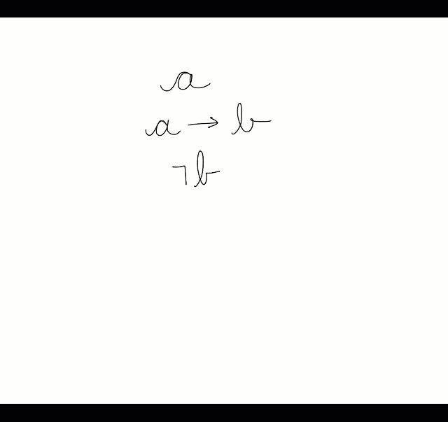
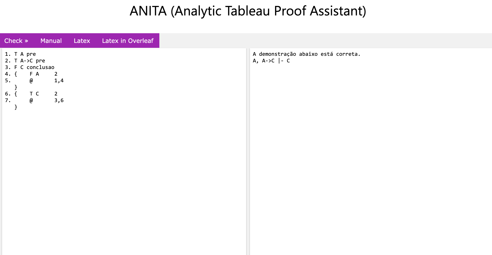
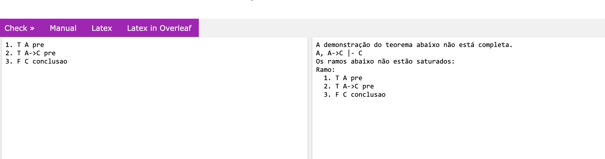
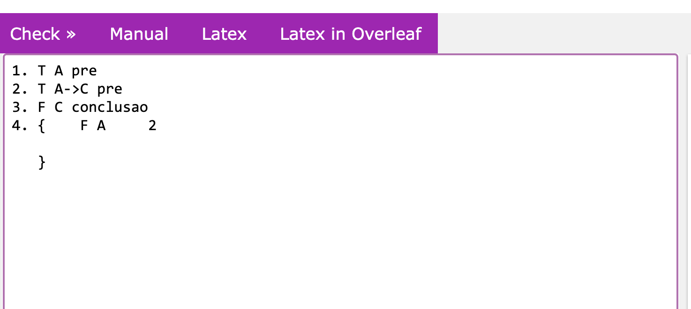
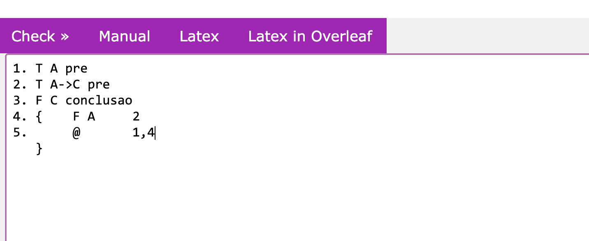
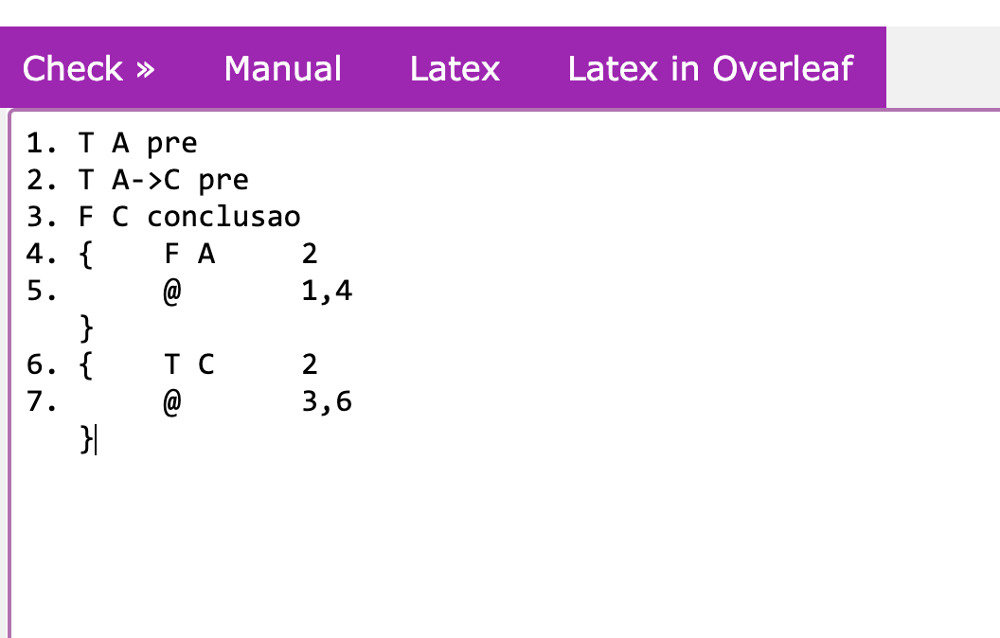
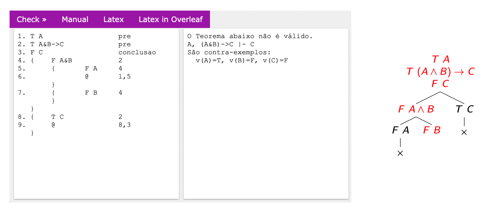
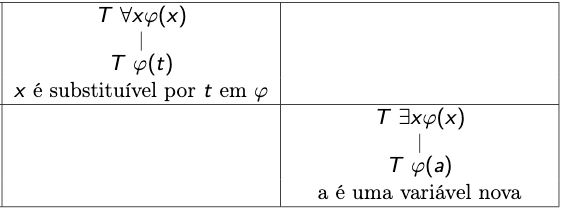
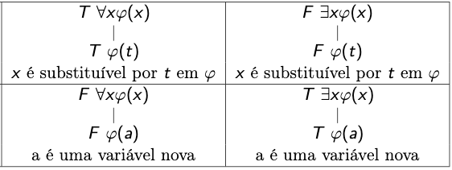
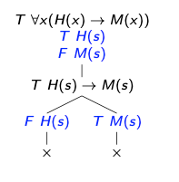

# ANITA (ANalytic Tableau proof Assistant)

Nada melhor que usar botar a mão na massa para motivar o uso de uma teoria. Usamos tableaux à vontade, em vários momentos, para verificar a *satisfazibilidade* ou a *validade* de uma fórmula, tanto em lógica proposicional como em lógica de predicados. Mesmo assim, o tableaux é bom mesmo para verificar a *validade de argumentos*. Vamos usar esse aqui como exemplo:

*a,a→c ⊨ c*

O Tableaux, para argumentos, é baseado em *refutação*: para provar que o argumento é válido, afirmamos que as premissas são verdadeiras, e assumimos que a conclusão é falsa, na esperança de chegar a uma contradição! Se não chegarmos a essa esperada contradição, então chegaremos no *contra-exemplo*. Em outras palavras, uma situação de valores (interpretação) que satisfaz as premissas e não satisfaz a conclusão. 

Um tableaux para provar a validade do argumento acima:

Ok, acredito em você, já sabe como fazer um tableaux. Mas eu sei que você quer alguma coisa que ajude a checar se está tudo bem com a sua árvore de Tableux, não é? Eu também queria. E olha só o que tem disponível, um CHECADOR de tableaux.

Eis que você pode ir para a ferramenta online ANITA, visitando o link aqui:  <https://sistemas.quixada.ufc.br/anita>. A ferramenta está sendo desenvolvida pelo Prof. Davi Romero Vasconcelos, da UFC. Na ferramenta, você escreve o seu tableaux, usando a notação da ferramenta, e ela te diz se o tableaux representa uma prova correta de argumento.

Eis a interface, sem muito segredo:

Do lado esquerdo, escrevemos o tableaux, e a ferramenta nos dá o feedback do lado direito. Bem simples e direto. O que complica, de início, é que a notação exigida nos deixa indecisos; mas nada que não seja rapidamente adquirido - basta olhar a referência. Vou seguir com o mesmo exemplo, passo a passo. 

Começo com as premissas e a conclusão. Percebam que coloco a numeração das linhas. Enquanto a letra T na frente da fórmula representa sua afirmação, a letra F representa sua *negação*; *F a -> b* para nós é o mesmo que *¬(a -> b)*. Do lado direito, indicamos premissas com *pre* e a conclusão.

Ao clicar em *Check*, a ferramenta me mostra que a demonstração não está completa. Eu já sabia disso, né, afinal nem comecei a fazer a prova ainda! Mas vamos em frente; vou ter que aplicar a regra beta da implicação na linha 2, e para isso tenho que abrir uma bifurcação, que se define aqui com chave {}. Vou começar com a negação de *a*, o lado esquerdo da nossa regra beta. 

Note que do lado direito adicionei uma referência à linha original da implicação, a Linha 2. A ferramenta precisa da origem da fórmula para verificar se você aplicou a regra corretamente. Nesse caso, achei uma contradição, pois existe um literal complementar *a* na linha 1; para indicar isso, usamos *@*, e indicamos a localização desses complementares (1,4).

Se você clicar em *Checar*, vai aparecer algo como: "Erro na linha 4: Uma regra do tipo beta tem que ter exatamente dois ramos." Isso nos indica que precisamos terminar a prova, com o outro lado da regra beta.

Legal, finalizamos essa prova assim.

Aqui outro exemplo de tableaux para lógica proposicional, que trouxe do manual da ferramenta <https://sistemas.quixada.ufc.br/anita/figs/MANUAL-ANITA.pdf>. Nesse caso, o argumento é inválido, e há um contra-exemplo. 

## Lógica de predicados

As regras para eliminação de quantificadores são, aqui, aplicadas de uma forma um pouquinho diferente, principalmente para o caso da negação. Quando T está na frente do para-todo ou do existe, a regra fica igual a que vimos: removemos o existe com uma variável nova, e o para-todo com uma variável qualquer arbitrária.

Já quando há uma negação, você deve pular o estágio de troca de quantificador, já eliminando tudo de uma vez. No caso do para-todo negado, já trocamos pela negação da parte interna, com variável nova (ou seja, uma eliminação de existe); o mesmo ocorre com a negação do existe, mas levando a uma fórmula negada com uma variável arbitrária qualquer.

Vamos usar como exemplo aqui o seguinte argumento, onde *s* é uma constante do conjunto universo:

*∀x(H(x)→M(x)), H(s)⊧ M(s)*

O tableaux para prova a validade ficaria assim (já usando a notação do ANITA, com F no lugar da negação):

## Outros link úteis

Aula do Prof. Adolfo Neto (UTFPR) sobre ANITA: <https://youtu.be/CbjYClMLiFI>

Artigo original sobre ANITA: <https://arxiv.org/abs/2303.05864>

Canal do Prof. Davi no Youtube: <https://www.youtube.com/@davivasconcelos9843>

