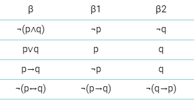

# Árvores e Tableaux Semântico

A tabela verdade nos persegue! Repete mais que filme novo do *Resident Evil*. Você já viu esse assunto várias vezes na sua vida, e eis que aqui, em lógica, de novo, você teve que mergulhar nele, que preguiça! De fato, na lógica, a tabela verdade tem mil e uma utilidades: podemos com ela investigar propriedades tanto de **fórmulas** quanto de **argumentos**.

Você lembra, né, que pra saber se uma fórmula é válida/tautologia/verdade lógica (só modelos!) ou satisfazível (pelo menos um modelo), basta navegar de interpretação por interpretação, linhas da tabela verdade, pra achar a resposta. Dá pra investigar também se duas fórmulas são equivalentes, consultando a coincidência do resultado de suas tabelas. Ah, e pra argumentos? Dá pra ver se eles são válidos, olhando pra tabela que incluir as premissas e a conclusão. E aí, quando se tem linhas em que as premissas são verdadeiras e a conclusão é falsa, temos um argumento *inválido*, caso contrário, garantimos que ele é *válido*.

Mesmo tendo uma ferramenta tão útil nas nossas mãos, a lógica desenvolveu vários outros métodos alternativos pra fazer tudo isso aí. E tem pelo menos dois bons motivos nessa busca por alternativas. Primeiro, tabelas verdade só funcionam bem pra lógica proposicional; pra outras lógicas mais complexas, elas deixam de ser úteis, e vamos ter que descartá-las quando chegarmos lá. Segundo, e não menos importante, tabelas verdade são muito, muito **custosas** pra construir. Com apenas cinco proposições atômicas em uma fórmula, a tabela já fica com 32 linhas; ou seja, custo exponencial -- para n variáveis,  linhas, um horror. 

Uma alternativa é tentar evitar construir *todas* as linhas, e sim direcionar nossa busca para linhas mais promissoras de alguma forma, dependendo do intuito da busca. Por exemplo, se queremos ver se uma fórmula é satisfazível, tentar investigar a fundo apenas as interpretações que, dependendo da fórmula, tendem a nos levar mais rápido a uma solução que satisfaz (um modelo). Em essência, isso pode acontecer se estruturarmos a solução não mais em termos de uma tabela, mas como uma **árvore** de fórmulas e proposições.

Árvores são um velho amor das computeiras e dos computeiros em geral, só não gostamos mais de árvore que de café. A gente usa árvore pra um monte de coisa, e vocês vão vê-las bastante até o diploma. Ah, uma coisa importante, a gente desenha árvore de cabeça pra baixo, a raíz pra cima e os ramos e folhas pra baixo, ok? 

E afinal, o que é legal numa árvore pra lógica? Ela permite que a gente considere apenas as partes de uma fórmula que podem ser verdade por testes parciais, e então, com essas certezas dos testes, podemos explorar as partes da fórmula que prometem ser verdade. Ou seja, árvores são ótimas pra **testar (e provar) que uma fórmula, ou um conjunto de fórmulas, é satisfazível**. Mas isso não vai nos impedir de aplicar árvores com outros intuitos, como vocês vão ver depois. Numa árvore, no geral, começamos escrevendo proposições que supomos ser verdadeiras. A partir delas, derivamos, descendo na árvore, proposições menores que têm que ser verdadeiras, caso o sejam as originais. Por exemplo, f ∧ g sendo a fórmula original, sabemos que para ela ser verdadeira tanto f como g precisam ser verdadeiras (proposições menores, derivadas da primeira). A partir dessa derivação -- que é disciplinada por certas regrinhas -- chegamos a dois resultados possíveis: uma contradição (insatisfação) ou um cenário verdadeiro, que nos dá um possível modelo para a fórmula original.

Nossa primeira aplicação de árvores é chamada Tableaux semântico, que testa se uma fórmula é satisfazível. As regras que veremos aqui servirão para nossas outras aplicações de árvore, mais à frente.

## Tableaux Semântico

Vamos começar com algumas definições básicas que vão ser importantes. 
* Sabemos o que são átomos, ou proposições atômicas: *p, q, r, w*
* Sabemos o que são fórmulas, juntando os átomos com conectivos: *(p∧ q)→r*,*¬(q∨ r)*

Agora, vamos nos referir a um novo conceito, o de **literal**.
> Um literal é um átomo ou uma negação de átomo. Por exemplo: *p,¬q, ¬r*

O tableaux semântico é um algoritmo, baseado em árvore, que tenta encontrar um modelo para uma fórmula, de forma sistemática, até encontrar (resultado verdadeiro) ou não (resultado falso). Desta forma, o algoritmo responde se uma fórmula é **satisfazível**.

A árvore sempre se inicia com a raíz, a fórmula completa que queremos mostrar que é satisfazível. A partir dela, procuramos o seu conectivo principal, o mais importante. Exemplos:
* (a **→** (b → a)): a primeira implicação
* ((a → b) **∧** c): a conjunção
* **¬**(a∧b): a negação

A partir desse conectivo, quebramos a fórmula em subfórmulas. Quais subfórmulas? Depende do conectivo. Vamos pegar um dos exemplos e desenvolver, ((a → b) **∧** c). Nesse caso, temos uma conjunção, o que define que, pra essa fórmula ser verdade, tanto a subfórmula *(a → b)* como *c* devem ser verdade também, *ao mesmo tempo*. Quando é assim, a gente separa as duas subfórmulas como tendo que ser verdade juntas, com uma vírgula, criando um novo nó na nossa árvore.

Chamamos essa regra que cria apenas um nó, com duas verdades obrigatórias, de **regra alfa**. Todas as fórmulas *conjuntivas* podem ser entrada pra essa regra, veja a tabela abaixo. O que quero dizer com fórmula conjuntiva é aquela que no fim vai dar em conjunção depois de alguma manipulação. Por exemplo, ¬(a∨b), por De Morgan, no fim é ¬a ∧ ¬b, uma conjunção. Mesma coisa pra dupla negação e pra negação de uma implicação, além da bi-implicação.

Vamos em frente no nosso exemplo. A condição de parada do algoritmo é quando **o nó só tem literais**, o que não é o caso, pois temos *(a → b)*. Assim, temos que continuar descendo, cara pálida. Sabemos que uma implicação no fim é uma disjunção, ¬a ∨ b. Quando temos uma disjunção, temos que considerar **duas possibilidades** de verdade, por isso criamos na árvore uma bifurcação, que chamamos de **regra beta**.

Com isso, temos dois novos nós na árvore. Como neles só tem literais, chegamos ao final desse ramo da árvore, assim eles não terão filhos (são **nós-folha**). As regras beta para fórmulas disjuntivas podem ser vistas abaixo. Não esqueça que, ao aplicar uma regra beta, todas as subfórmulas que precisam se confirmar verdadeiras (separadas por vírgula) precisam ser copiadas para ambos filhos abaixo. 

Chegou a hora então do algoritmo fazer sua análise final, verificar se o nó-folha é aberto ou fechado. Um nó **aberto** é satisfazível, ou seja, não tem contradição. Contradição aqui seria a presença de dois literais **complementares**, por exemplo ¬a, a no mesmo nó; isso nos diria que aquele caminho na árvore não pode ser verdadeiro, então o nó estaria **fechado**. Nesse caso, nenhum dos dois nós possui literais complementares, então ambos são satisfazíveis, ou seja, abertos. A presença de pelo menos um nó-folha aberto prova que a fórmula original é satisfazível. Além desse resultado, qualquer um dos nós-folha *nos oferece a interpretação que define um modelo pra fórmula*; por exemplo, um nó com ¬a,c nos diz que qualquer interpretação com a=F e c=T define um modelo na tabela verdade dessa fórmula. 

Vejamos um exemplo com nós fechados. Na figura abaixo, temos uma fórmula claramente contraditória, portanto insatisfazível. Ao fazer seu tableaux semântico, chegamos, como resultado, em dois nós-folha, ambos apresentando pelo menos um par de literais complementares. Assim, os dois são fechados; não tendo nenhum nó aberto, o algoritmo então nos responde, FALSO.

Ah, também importante, não podemos esquecer, que o algoritmo nunca pode provar que uma fórmula é tautologia (válida), mesmo que todos os nós da árvore sejam abertos. Vejam o exemplo com a fórmula ¬(a ∧ b) ∨ (c ∧ b).

Com tanto nó aberto assim, dá a impressão que essa fórmula seria sempre verdadeira, portanto uma tautologia. No entanto, veja o que acontece com ela na interpretação a=T, b=T e c=F. Isso mesmo! Dá falso. Então, não se engane, Tableaux semântico não mostra a validade de uma fórmula. Mas, mas mas, no entanto, por outro lado, porém, tem um jeitinho da gente mostrar validade de uma fórmula usando o tableaux, mas nesse caso a gente não a usa direto no algoritmo, a gente disfarça ela primeiro, põe um bigode falso, um par de óculos, antes do Tableaux entrar em ação.

Como é possível ver no esquema acima, se você negar a fórmula original e rodar o Tableaux, você prova que ela é uma tautologia se a negação sempre resultar **em falso**, ou seja, insatisfazível. Lembrando, um procedimento que testa satisfazibilidade pode ser usado para testar validade, e vice-versa, com as negações aplicadas corretamente.

### Forma alternativa de representação

Para facilitar desenho e análise do tableaux, podemos trabalhar de uma forma gráfica mais simples. Considere a verificação de satisfazibilidade abaixo, para a fórmula (A → B) ∧ (B → A), que resulta em dois nós-folha abertos e dois fechados.

Do jeito que a gente viu até agora, temos várias repetições de fórmulas e literais, pois, a cada regra beta aplicada, trazemos junto as fórmulas (B → A) e literais (¬A,B) que já eram consideradas antes, para verificar a presença do par de literais complementares no final. Mas tem um jeito que evita a repetição, que modifica a forma como verificamos a satisfação; não vamos olhar mais para os nós-folha, mas os **caminhos** na árvore. Um caminho na árvore é uma rota completa começando na proposição mais acima até um nó-folha. Nesta representação alternativa, fórmulas e subfórmulas aparecem apenas uma vez na árvore, como na figura a seguir, com o mesmo exemplo.

A primeira regra alfa aplicada desenha as duas subfórmulas (A → B) e (B → A) apenas uma vez, colocando um sinal verde na fórmula, mostrando que ela já foi "decomposta". Fazemos isso também com (B → A), através da regra beta que gera os nós abaixo. Na figura a seguir, desenvolvemos B → A com outra regra beta, finalizando a árvore, pois não há mais fórmulas a desenvolver.

Pois então vamos verificar. Percebam que agora os nós-folha não tem mais conjuntos de literais, mas apenas um. No entanto, vamos olhar agora pros caminhos a partir da raiz da árvore. Um caminho *fechado* é aquele que, durante o caminho, encontra literais complementares! Não é muito diferente, né? Já um caminho *aberto* não passa por literais complementares. Assim, se a árvore tiver todos os caminhos fechados a partir da raiz para as folhas ela é insatisfazível. Nosso exemplo é satisfazível pois apresenta pelo menos um caminho aberto...vejam na figura.

Provavelmente usaremos mais esta representação daqui pra frente, pela economia de espaço.

### Desempenho do Tableaux

Bom, pra finalizar, vamos falar sobre o desempenho deste novo método pra verificar se uma fórmula é satisfazível. Será que, usando uma árvore, conseguiremos um procedimento mais rápido que a tabela-verdade? O uso de árvores normalmente implica alguma melhora de desempenho.

Neste caso, sim, há uma melhora no desempenho. No entanto, teoricamente, não é bem assim, porque, dependendo da estrutura da fórmula, se ela incluir n proposições atômicas, a árvore pode gerar   nós-folha, aqueles apenas com literais complementares. Se acontecer desta fórmula ser insatisfazível -- o pior caso -- o algoritmo vai acabar fazendo o mesmo número de testes que seriam realizados em uma tabela-verdade. De novo, um horror!

Felizmente, na prática, o tableaux acaba sendo mais eficiente, pois uma estrutura de fórmula mais amigável, e com mais algumas otimizações, seu desempenho medido acaba sendo melhor. Por exemplo, a árvore tende a ficar menor se o algoritmo preferir sempre aplicar uma regra alfa antes de uma regra beta, já que esta sempre bifurca a árvore, criando dois ramos, o que em geral aumenta a árvore e o número de testes. Otimizações como essa acabam fazendo o algoritmo ficar mais rápido.  

