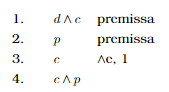

# Outros Métodos de Prova em Lógica

Para o caso da lógica proposicional, vimos dois métodos de prova de propriedades de fórmulas (validade e satisfazibilidade) e argumentos (validade): tabela-verdade e árvores. Para a lógica de predicados, perdemos o poder de usar tabelas-verdade, por estarmos lidando com infinitos modelos em potencial, mas ainda mantemos a possibilidade de utilizar árvores, com novas regras de desenvolvimento.

Na verdade, vários outros métodos de prova foram desenvolvidos ao longo de história, que funcionam para ambas as lógicas. Neste módulo, faremos um breve passeio por alguns deles, entendendo seus pontos fortes e suas limitações.

Antes de começar, deixa eu revisitar o que devemos entender como **prova formal**. 
Na lógica, primeiro precisa existir um conjunto específico de símbolos a partir dos quais construímos uma prova — os símbolos de uma linguagem lógica, como as duas que vimos na disciplina, junto com alguns símbolos adicionais para organizar a prova.
Qualquer sequência desses símbolos pode ser então uma candidata a receber o título de *prova*; pode ainda não ser, dependendo de uma verificação. 
Segundo, deve haver um *procedimento de decisão* para determinar, dentro de um tempo finito,  se uma sequência candidata a prova é realmente uma prova — algum tipo de algoritmo que recebe a prova candidata como entrada e retorna *sim* ou *não*.  O procedimento deve então ser preciso, para que não haja dúvida sobre a resposta.
Desta forma, as provas precisam também ser *finitas*, algo que é intuitivamente correto: nenhum algoritmo pode ser finito verificando algo infinito.

Vamos verificar, como exemplo, o método de prova com árvores (Tableaux). A sequência de símbolos é a lógica de predicados, adicionada de símbolos gráficos, como traços e números, que ajudam a *desenhar* a prova. Como estamos sempre lidando com fórmulas com um número finito de predicados, quantificadores e conectivos, o número de nós da árvore nunca será infinito, consequentemente a árvore terá um número finito de caminhos. Assumindo isso, temos um procedimento de decisão preciso que sempre termina, pois verifica se, para cada caminho, o mesmo está aberto ou fechado. Desta forma, podemos classificar a árvore do Tableaux como um método de prova formal para *satisfazibilidade* da lógica de predicados.

Os quatro métodos (também chamados de estilos) de prova formal são tableaux (o método da árvore é só um dos tipos de tableaux), axiomático, dedução natural e cálculo de sequents (muito usado em ferramentas provadoras de teoremas). Vamos dar uma olha nos métodos **axiomático** e **dedução**.

## Sistemas Axiomáticos

Começo novamente resgatando as árvores: todas elas trazem informação sobre *satisfazibilidade* apenas. Se a árvore tem apenas caminhos fechados, o conjunto de fórmulas na raiz é insatisfazível; se algum caminho sobrar aberto, há pelo menos um caso (modelo) para satisfação. Assim, é natural dizer que a principal noção de provas em árvores é a satisfazibilidade de um conjunto de fórmulas. 

Por outro lado, em sistemas **axiomáticos** de prova (também conhecidos como sistemas de *Hilbert* ou *Hilbert-Frege*), a noção é provar a **validade** de uma fórmula. Sim, *uma* fórmula apenas; nesses sistemas, queremos verificar se uma fórmula é sempre verdadeira. Vou mostrar um primeiro exemplo de prova axiomática, e ir explicando aos poucos os componentes.

Suponha que queremos demonstrar se a seguinte fórmula *(¬P →P)→P* é válida (vou começar com a lógica proposicional, que é mais fácil, depois estendo para predicados). Ajuda saber, já já explico por quê, que ela é sim válida, por isso é seguro tentar a prova. Para começar, temos que ter um lugar de onde partir, para começar essa prova, algumas afirmações que sabemos ser válidas sempre, uma base de lançamento segura. Fórmulas que sabemos ser válidas independente de outras, essas vamos chamar de **axiomas**. Querem ver três exemplos de axiomas?

(A1) *α→(β →α)*

(A2)  *(α→(β →γ ))→((α→β)→(α→γ))*

(A3) *(¬β →¬α)→((¬β →α)→β)*

Parecem complicadas, eu sei. Atentem-se para A1, que é a mais fácil, considerando aqui que α e β representam **uma fórmula qualquer bem-formada**. Assim, em A1, se você colocar uma fórmula qualquer do lado esquerdo de uma implicação, e do lado direito colocar qualquer outra fórmula implicando na primeira novamente, isso *sempre será verdade*. Se *α=p∨ q* e *β=q*, é só conferir: *(p∨ q)→(q→(p∨ q))* só tem modelos na sua tabela verdade.

Se tivermos algumas fórmulas iniciais pra começar, precisamos tentar chegar, a partir delas, na fórmula que queremos provar como válida. Faremos isso através de algumas transformações sintáticas nas fórmulas, e teremos certeza de que as transformações são corretas é através de **regras de inferência**. Olha aí um exemplo, que a gente chama tradicionalmente de *Modus Ponens*, do latim para "Modo de Afirmar".

Regra (MP):

Na regra, α e β são, novamente, qualquer fórmula. Antes do triângulo, temos as entradas da regra, e depois, a saída, o resultado. Aqui, leia-se: se uma implicação for válida, e o lado esquerdo dela também for, então podemos gerar uma nova linha na prova, com o lado direito dessa implicação sozinho. Os três axiomas e a regra MP formam um **sistema axiomático**, e já dá para explorar algumas provas com esse sistema bem pequenininho.

Abaixo, usando esse sistema, mostro como podemos estruturar uma prova no método axiomático. Começamos usando os axiomas A1 e A2, substituindo α,β,γ com fórmulas que parecem ser úteis para esta prova específica.

Por exemplo, na linha 1, escolhemos *α=¬P* e *β=(¬P →¬P)*. Já na linha 2, podemos ver a aplicação de A2 como uma *distribuição da implicação* com *α=¬P*, *β=(¬P →¬P)*, *γ=¬P*.

Continuemos com a prova seguindo o estilo axiomático. A partir das Linhas 1 e 2, podemos aplicar a regra MP para chegar a uma nova fórmula, em uma nova linha, também válida. 

O resultado é outra implicação! Assim, podemos tentar usar novamente axiomas para aplicar de novo MP, até chegarmos ao resultado que queríamos demonstrar: *(¬P →P)→P*.

A partir do exemplo, conseguimos estabelecer algumas ideias gerais de uma prova formal axiomática; ela é uma sequência de fórmulas bem formadas, em que cada fórmula dessa sequência ou é um axioma ou o resultado de aplicação de uma regra de inferência, usando como entrada algumas fórmulas anteriores na sequência. A prova da validade de uma fórmula têm esta como última fórmula da sequência. Se existe uma prova formal para uma fórmula α dentro de um sistema axiomático A, então *α é um teorema do sistema A*; simbolicamente, . O símbolo  reflete uma prova formal, sintática, de um teorema ou argumento (compare com vinculação semântica, símbolo ). 

Até agora, tudo ok. Mas, claramente, dentro de um sistema tão pequeno como este, dificilmente poderemos provar todos os teoremas da lógica proposicional; por exemplo, não dá para provar *P ∨  ¬P*, já que nenhum dos axiomas pode lidar com disjunções. Isso nos leva a discutir um ponto importante. É interessante manter um sistema de prova simples, minimizando o número de axiomas e regras; por isso, é *muito comum* confinar a linguagem aceita pelo sistema a uma **porção restrita da linguagem completa**. 

Por exemplo, sabe-se que {*→,¬*} é um conjunto **núcleo (core) de conectivos** da lógica proposicional! Quer dizer que *qualquer fórmula* nessa lógica pode ser representada apenas pode esses dois conectivos.  Olhem as equivalências abaixo que permitem fazer isso:

Então, para mostrar que  *P ∨  ¬P* é válido, basta transformá-la em *(¬P →P)→P*, e então...opa, já mostramos isso, não é? As primeiras cinco linhas da prova axiomática anterior fazem exatamente isso.

Para a lógica de predicados, existem sistemas axiomáticos na literatura com  axiomas e  regras de inferência considerando uma linguagem apenas com o quantificador universal. Para isso funcionar, temos que lembrar que um quantificador existencial pode ser escrito como universal com negações:  equivalente a .

Por fim, quero mostrar o uso de um sistema axiomático para demonstrar um argumento. Neste caso, as premissas são consideradas como *assumptions* (A na figura abaixo), colocadas como fórmulas válidas na prova, junto com axiomas e resultados da aplicação de regras. Aqui, demonstramos que o argumento .

## Dedução Natural

Já repeti algumas vezes, mas vou voltar novamente a uma mesma ideia: *verificar a validade de um argumento* é o que interessa em lógica. Tudo que você viu e vai ver gira em torno desta mesma tarefa. Um argumento informal poderia ser escrito assim:

**O programa calcula o número de disciplinas cursadas e calcula o CRE do aluno. O programa foi feito em Python. Portanto, o programa calcula o CRE do aluno e foi feito em Python.**

Poderíamos codificar este argumento da seguinte forma, usando lógica proposicional:

* Primeira premissa: d ∧ c
* Segunda premissa: p
* Conclusão: c ∧ p

Com a intervenção humana, podemos verificar um argumento por **demonstração**, muitas vezes de forma mais simples. 
Como provador, seu objetivo é transformar as premissas na conclusão, através de **transformações sintáticas** corretas. Essas transformações são corretas se seguirem a aplicação da mesma ideia que usamos em métodos axiomáticos -- regras de inferência, que garantem a consistência das fórmulas resultantes da transformação de verdades anteriores.
O estilo de prova chamado **Dedução Natural** é similar na ideia de gerar novas fórmulas consistentes com as anteriores; a diferença crucial é a dedução natural é mais aplicável, com apenas um sistema por linguagem, com regras definidas *por conectivo*. Além disso, apenas em sistemas naturais podemos fazer hipóteses temporárias (**caixas**), com essas hipóteses possivelmente sendo dispensada (*discharged*) quando o propósito da hipótese for atingido. Mais em exemplos em breve.

Este é um sistema de prova que reflete melhor nossa prática rotineira de raciocínio, por isso o chamamos de **Natural**. Iniciar com as premissas, ir gerando novas proposições, até chegarmos no resultado do raciocínio, a conclusão. Ao aplicar essas regras às premissas, esperamos que chegaremos a mais algumas fórmulas, e se aplicarmos mais regras a estas, em algum momento chegaremos na fórmula da conclusão.

Um sistema de dedução natural não possui axiomas. As regras são organizadas por conectivo, divididas entre regras de *introdução* e regras de *eliminação*. Vamos iniciar com as duas regras referentes à conjunção:

Uma regra deve ser lida de cima para baixo; acima do traço, temos as fórmulas de entrada da regra, necessariamente já conhecidas como verdadeiras, e abaixo do traço, temos a fórmula resultante da regra. Na regra de introdução da conjunção , se forem provadas como verdadeiras as fórmulas , podemos deduzir a conjunção entre os dois. Já na eliminação da conjunção (), basta que se tenha como verdadeira uma conjunção de duas fórmulas, qualquer uma delas pode ser tomada como verdade, já que as duas são verdadeiras ao mesmo tempo. 

Você deve estar achando essas regras bem fáceis, e nisso concordo com você. Ainda assim, saber aplicá-las exige um pouco mais de habilidade, e é neste ponto que eu quero exercitar a habilidade de dedução. Vamos voltar ao argumento de exemplo, reescrevendo-o para a utilização da dedução natural.

 Supondo que temos que realizar a prova de validade deste argumento, vamos montar o esquema de dedução, que é o primeiro passo para uma prova correta e organizada. Isso é importante, pois demonstrações são feitas para convencer outras pessoas por isso têm que ser precisas e claras. A primeira coisa é copiar as premissas, uma por linha numerada.

A ideia aqui é usar estas duas linhas como origem para transformações que vão gerar a conclusão. Acho importante você deixar um espaço e já *escrever a conclusão*, na última linha, mesmo sem saber ainda qual o número desta linha na prova completa.

Essa prática ajuda a saber onde queremos chegar, facilitando a definição da estratégia a utilizar. Olhando para a conclusão, você deve se perguntar: ``Qual o caminho mais apropriado para chegar a este tipo de conclusão?'' O que chamo de tipo de conclusão consiste na estrutura da fórmula. Neste caso, a conclusão tem uma estrutura de conjunção -- este é o conectivo principal da fórmula.

Voltando à nossa dedução, qual seria a melhor forma de chegar a uma conjunção? 
Que regras deveríamos aplicar para chegar lá? Como só vimos duas regras até agora, é simples:  para chegar a esta conjunção (*c ∧ p*), precisamos chegar a cada um dos lados da conjunção isoladamente, para no final juntar os dois no resultado, utilizando a regra . Você poderia já colocar estes dois lados nas linhas acima da conclusão, assim:

Agora nosso trabalho se resume a tentar deduzir *c e p* isoladamente. A proposição *p* já é premissa, então ela já é válida nesta dedução, por isso vou apagar.

O problema que resta é chegar ao *c* isolado. Você tem agora que olhar as premissas para tentar delas derivar o resultado desejado. Veja que na Linha 1 temos a conjunção cujo um dos lados é exatamente *c*, que eu posso extrair usando a regra de eliminação. A criação da nova linha exige uma justificativa, que fica do lado direito, incluindo o nome da regra e a linha de onde vêm as entradas da regra (nesta regra, só há uma entrada, a Linha 1):

Temos os dois lados isolados na dedução, assim você pode finalizar a prova com o último passo de introduzir a conjunção. Como a linha já está colocada, falta apenas justificá-la como resultado.

Perceba que duas linhas foram usadas na justificativa, já que esta regra precisa de duas entradas (cada lado da conjunção). Um sistema de dedução natural para a lógica de predicados completo possui um número bem razoável de regras, pois cada conectivo e quantificador define duas regras, introdução e eliminação. Vamos nos limitar aqui a discutir regras para implicação, só para dar um gostinho de como se faz dedução com caixas.

Para a implicação, começamos do jeito mais simples, a sua eliminação (deixemos a introdução para depois, já que precisaremos de um conceito novo). A eliminação da implicação é definida assim:

A eliminação da implicação nada mais é que a regra que já vimos no sistema axiomático, *Modus Ponens* (Modo de Afirmar). Nela, se sabemos ser verdade a própria implicação, e sabemos ser verdade seu lado esquerdo, com certeza o lado direito é verdadeiro.   Uma outra regra que vamos adicionar é análoga a esta: *Modus Tolens* (Modo de Negar), que permite deduzir a fórmula do lado esquerdo de uma implicação quando tem-se como verdadeira a **negação da fórmula do lado direito**.

Aqui tem uma novidade: teremos agora como \textit{introduzir} uma implicação onde não existe uma. Lembre-se de que uma fórmula como *p→q* não afirma *p* nem *q*. Criar uma implicação em uma dedução exige que criemos \textit{hipóteses temporárias}, cujo efeito (escopo) é limitado a apenas um pedaço da dedução -- um trecho dentro da lista ordenada de linhas numeradas. Este trecho temporário é representado por uma espécie de quadro de contorno sólido, uma *caixa*.

Vamos trabalhar em cima de um exemplo de argumento:

Vou começar escrevendo a premissa, seguida da conclusão no final. O espaço em branco entre elas será nossa área de trabalho, onde vamos pensar a estratégia.

Nosso objetivo é chegar numa implicação, mas ela não existe na dedução ainda, vamos assim precisar criar de algum lugar. Vamos criar as condições para que uma implicação possa ser deduzida: vou **assumir como verdadeira** a fórmula esquerda da implicação desejada *c*. Não quer dizer que ela seja, talvez não seja, mas vou assumir como uma hipótese; já que não sabemos se ela existe, então a colocaremos dentro de um espaço temporário, onde as fórmulas anteriores também são verdadeiras, junto com essa hipótese. No final da caixa, queremos que esta hipótese seja dispensada (*discharged*).

É importante pensar que a caixa é uma sub-dedução dentro da dedução maior; neste caso, podemos usar Linhas 1 e 2 como verdade para a dedução dentro da caixa. Neste caso, se conseguirmos deduzir, no final dela, o lado direito da implicação desejada (*¬¬j*), chegamos à conclusão que queríamos; partimos, assumindo o lado direito, numa dedução que leva ao lado direito, ou seja,**o lado direito foi realmente implicado a partir do lado esquerdo**! 

Perceba que nosso problema da caixa para fora está resolvido, basta agora resolver o miolo da caixa. Precisamos então, a partir das Linhas 1 e 2, chegar em *¬¬j*. Mas, veja, o final da caixa, onde queremos chegar, é justamente o lado esquerdo negado da implicação da Linha 1! Se eu perguntar qual a estratégia para chegar na negação do lado esquerdo de uma implicação, você vai rapidamente me responder que precisamos usar Modus Tolens, de algum jeito. Para isso, precisamos negar duplamente *c*, e para isso existem regras triviais para introdução e eliminação da dupla negação.

Caixas como essas são usadas em regras para disjunção, negação e contradição, além de quantificadores; se tiver curiosidade, leia textos completos sobre dedução natural em:

* Dedução para lógica proposicional: [outros_estilos/deducao-proposicional.pdf](outros_estilos/deducao-proposicional.pdf)
* Dedução para lógica de predicados: [outros_estilos/deducao-predicados.pdf](outros_estilos/deducao-predicados.pdf)