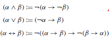

# Outros Métodos de Prova em Lógica

Para o caso da lógica proposicional, vimos dois métodos de prova de propriedades de fórmulas (validade e satisfazibilidade) e argumentos (validade): tabela-verdade e árvores. Para a lógica de predicados, perdemos o poder de usar tabelas-verdade, por estarmos lidando com infinitos modelos em potencial, mas ainda mantemos a possibilidade de utilizar árvores, com novas regras de desenvolvimento.

Na verdade, vários outros métodos de prova foram desenvolvidos ao longo de história, que funcionam para ambas as lógicas. Neste módulo, faremos um breve passeio por alguns deles, entendendo seus pontos fortes e suas limitações.

Antes de começar, deixa eu revisitar o que devemos entender como **prova formal**. 
Na lógica, primeiro precisa existir um conjunto específico de símbolos a partir dos quais construímos uma prova — os símbolos de uma linguagem lógica, como as duas que vimos na disciplina, junto com alguns símbolos adicionais para organizar a prova.
Qualquer sequência desses símbolos pode ser então uma candidata a receber o título de *prova*; pode ainda não ser, dependendo de uma verificação. 
Segundo, deve haver um *procedimento de decisão* para determinar, dentro de um tempo finito,  se uma sequência candidata a prova é realmente uma prova — algum tipo de algoritmo que recebe a prova candidata como entrada e retorna *sim* ou *não*.  O procedimento deve então ser preciso, para que não haja dúvida sobre a resposta.
Desta forma, as provas precisam também ser *finitas*, algo que é intuitivamente correto: nenhum algoritmo pode ser finito verificando algo infinito.

Vamos verificar, como exemplo, o método de prova com árvores (Tableaux). A sequência de símbolos é a lógica de predicados, adicionada de símbolos gráficos, como traços e números, que ajudam a *desenhar* a prova. Como estamos sempre lidando com fórmulas com um número finito de predicados, quantificadores e conectivos, o número de nós da árvore nunca será infinito, consequentemente a árvore terá um número finito de caminhos. Assumindo isso, temos um procedimento de decisão preciso que sempre termina, pois verifica se, para cada caminho, o mesmo está aberto ou fechado. Desta forma, podemos classificar a árvore do Tableaux como um método de prova formal para *satisfazibilidade* da lógica de predicados.

Os quatro métodos (também chamados de estilos) de prova formal são tableaux (o método da árvore é só um dos tipos de tableaux), axiomático, dedução natural e cálculo de sequents (muito usado em ferramentas provadoras de teoremas). Vamos dar uma olha nos métodos **axiomático** e **dedução**.

## Sistemas Axiomáticos

Começo novamente resgatando as árvores: todas elas trazem informação sobre *satisfazibilidade* apenas. Se a árvore tem apenas caminhos fechados, o conjunto de fórmulas na raiz é insatisfazível; se algum caminho sobrar aberto, há pelo menos um caso (modelo) para satisfação. Assim, é natural dizer que a principal noção de provas em árvores é a satisfazibilidade de um conjunto de fórmulas. 

Por outro lado, em sistemas **axiomáticos** de prova (também conhecidos como sistemas de *Hilbert* ou *Hilbert-Frege*), a noção é provar a **validade** de uma fórmula. Sim, *uma* fórmula apenas; nesses sistemas, queremos verificar se uma fórmula é sempre verdadeira. Vou mostrar um primeiro exemplo de prova axiomática, e ir explicando aos poucos os componentes.

Suponha que queremos demonstrar se a seguinte fórmula $(¬P →P)→P$ é válida (vou começar com a lógica proposicional, que é mais fácil, depois estendo para predicados). Ajuda saber, já já explico por quê, que ela é sim válida, por isso é seguro tentar a prova. Para começar, temos que ter um lugar de onde partir, para começar essa prova, algumas afirmações que sabemos ser válidas sempre, uma base de lançamento segura. Fórmulas que sabemos ser válidas independente de outras, essas vamos chamar de **axiomas**. Querem ver três exemplos de axiomas?

(A1) $α→(β →α)$

(A2)  $(α→(β →γ ))→((α→β)→(α→γ))$

(A3) $(¬β →¬α)→((¬β →α)→β)$

Parecem complicadas, eu sei. Atentem-se para A1, que é a mais fácil, considerando aqui que α e β representam **uma fórmula qualquer bem-formada**. Assim, em A1, se você colocar uma fórmula qualquer do lado esquerdo de uma implicação, e do lado direito colocar qualquer outra fórmula implicando na primeira novamente, isso *sempre será verdade*. Se $α=p\vee q$ e $β=q$, é só conferir: $(p\vee q)→(q→(p\vee q))$ só tem modelos na sua tabela verdade.

Se tivermos algumas fórmulas iniciais pra começar, precisamos tentar chegar, a partir delas, na fórmula que queremos provar como válida. Faremos isso através de algumas transformações sintáticas nas fórmulas, e teremos certeza de que as transformações são corretas é através de **regras de inferência**. Olha aí um exemplo, que a gente chama tradicionalmente de *Modus Ponens*, do latim para "Modo de Afirmar".

Regra (MP):

Na regra, α e β são, novamente, qualquer fórmula. Antes do triângulo, temos as entradas da regra, e depois, a saída, o resultado. Aqui, leia-se: se uma implicação for válida, e o lado esquerdo dela também for, então podemos gerar uma nova linha na prova, com o lado direito dessa implicação sozinho. Os três axiomas e a regra MP formam um **sistema axiomático**, e já dá para explorar algumas provas com esse sistema bem pequenininho.

Abaixo, usando esse sistema, mostro como podemos estruturar uma prova no método axiomático. Começamos usando os axiomas A1 e A2, substituindo α,β,γ com fórmulas que parecem ser úteis para esta prova específica.

Por exemplo, na linha 1, escolhemos $α=¬P$ e $β=(¬P →¬P)$. Já na linha 2, podemos ver a aplicação de A2 como uma *distribuição da implicação* com $α=¬P$, $β=(¬P →¬P)$, $γ=¬P$.

Continuemos com a prova seguindo o estilo axiomático. A partir das Linhas 1 e 2, podemos aplicar a regra MP para chegar a uma nova fórmula, em uma nova linha, também válida. 

O resultado é outra implicação! Assim, podemos tentar usar novamente axiomas para aplicar de novo MP, até chegarmos ao resultado que queríamos demonstrar: $(¬P →P)→P$.

A partir do exemplo, conseguimos estabelecer algumas ideias gerais de uma prova formal axiomática; ela é uma sequência de fórmulas bem formadas, em que cada fórmula dessa sequência ou é um axioma ou o resultado de aplicação de uma regra de inferência, usando como entrada algumas fórmulas anteriores na sequência. A prova da validade de uma fórmula têm esta como última fórmula da sequência. Se existe uma prova formal para uma fórmula α dentro de um sistema axiomático A, então *α é um teorema do sistema A*; simbolicamente, $\vdash_A α$. O símbolo $\vdash$ reflete uma prova formal, sintática, de um teorema ou argumento (compare com vinculação semântica, símbolo $\models$). 

Até agora, tudo ok. Mas, claramente, dentro de um sistema tão pequeno como este, dificilmente poderemos provar todos os teoremas da lógica proposicional; por exemplo, não dá para provar $P \vee \neg P$, já que nenhum dos axiomas pode lidar com disjunções. Isso nos leva a discutir um ponto importante. É interessante manter um sistema de prova simples, minimizando o número de axiomas e regras; por isso, é *muito comum* confinar a linguagem aceita pelo sistema a uma **porção restrita da linguagem completa**. 

Por exemplo, sabe-se que {$\rightarrow,\neg$} é um conjunto **núcleo (core) de conectivos** da lógica proposicional! Quer dizer que *qualquer fórmula* nessa lógica pode ser representada apenas pode esses dois conectivos.  Olhem as equivalências abaixo que permitem fazer isso:

Então, para mostrar que  $P \vee \neg P$ é válido, basta transformá-la em $(¬P →P)→P$, e então...opa, já mostramos isso, não é? As primeiras cinco linhas da prova axiomática anterior fazem exatamente isso.

Para a lógica de predicados, existem sistemas axiomáticos na literatura com  axiomas e  regras de inferência considerando uma linguagem apenas com o quantificador universal. Para isso funcionar, temos que lembrar que um quantificador existencial pode ser escrito como universal com negações: $\exists x \alpha$ equivalente a $\neg \forall x\neg\alpha$.

Por fim, quero mostrar o uso de um sistema axiomático para demonstrar um argumento. Neste caso, as premissas são consideradas como *assumptions* (A na figura abaixo), colocadas como fórmulas válidas na prova, junto com axiomas e resultados da aplicação de regras. Aqui, demonstramos que o argumento $P\rightarrow Q, Q \rightarrow R \vdash P \rightarrow R$.

## Dedução Natural

