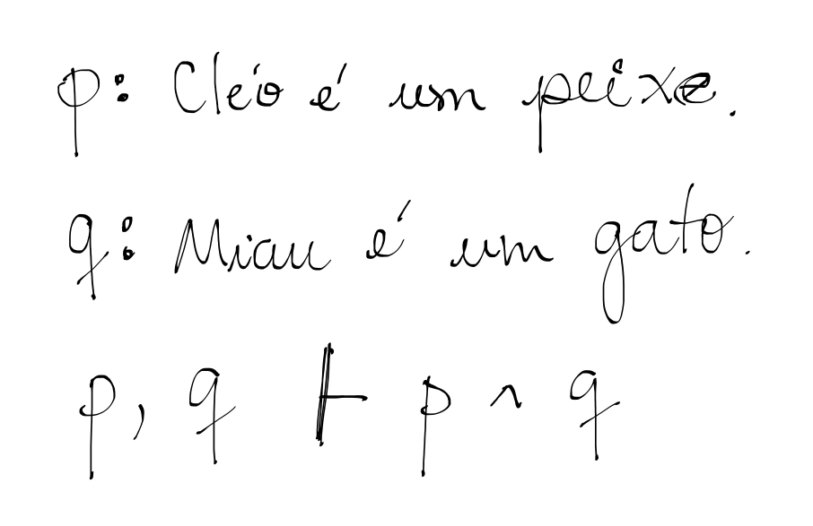
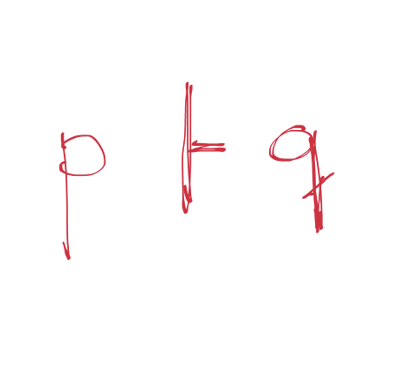
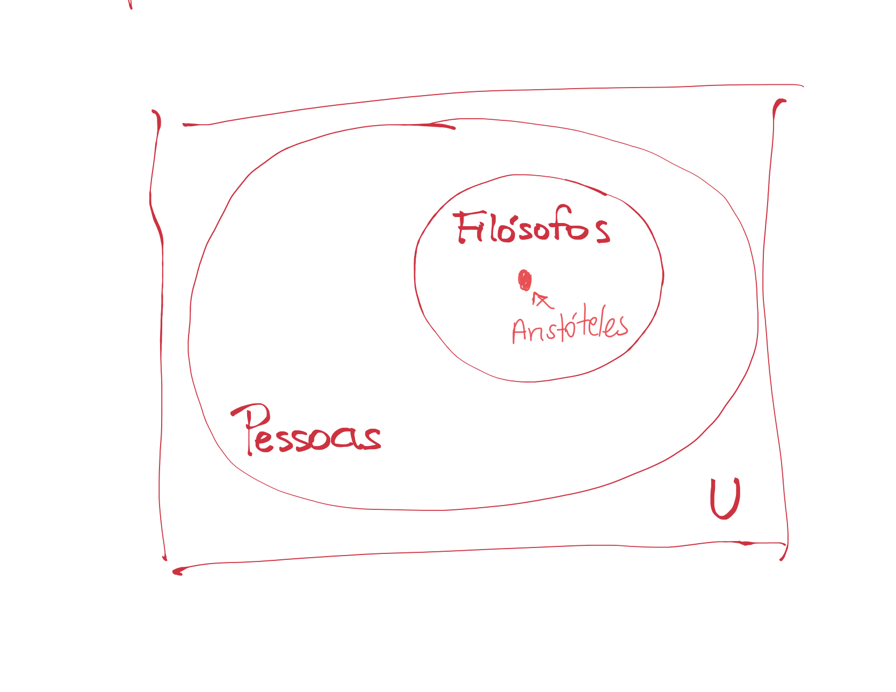
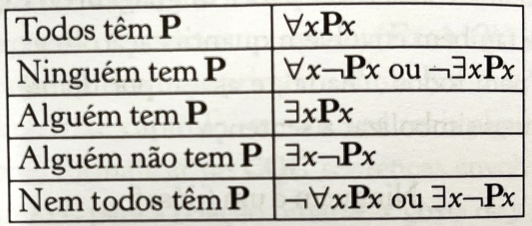
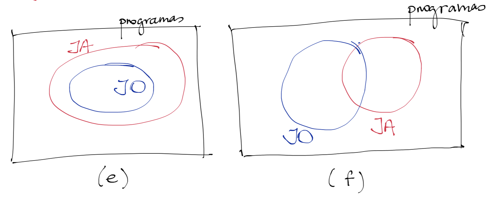

# Lógica de predicados

Até agora, vimos técnicas e algoritmos para resolver o mais importante problema da lógica: *o argumento (premissas,conclusão)é válido?* 
No entanto, tudo que aplicamos até agora teve como alvo fórmulas em lógica proposicional, aquelas, com letrinhas minúsculas (p,q,...) e os conectivos já conhecidos (conjunção, implicação, etc.). 
Mesmo tendo sido possível verificar muitos argumentos interessantes até agora, essas fórmulas simples não conseguem expressar o que precisamos para raciocinar sobre o mundo real, principalmente o mundo em que nossos sistemas computacionais funcionam. 
Em resumo, o mundo é muita areia pro caminhãozinho da lógica das proposições! 
Vamos entender por que isso acontece, e vamos nos organizar para estender a linguagem anterior com novos recursos que vão permitir melhorar a expressividade da lógica. 
A partir disso, vamos rever algumas técnicas e algoritmos para aplicá-los nessa nova linguagem. E, calma, você vai ver que boa parte dessa nova linguagem vem da anterior, então você não precisa aprender uma nova linguagem do zero.

## Por que precisamos de uma nova lógica?

Venho repetindo desde o começo dessa disciplina que testar a validade de um argumento (premissas e conclusão) é a razão da existência da lógica. Assim, nada melhor que começar refazendo um exercício desses. Algo simples, como pegar duas premissas e uma conclusão:



Intuitivamente, é válido. E logicamente, também! Usando tableaux, é fácil mostrar que usar as premissas com a conclusão negada não vai resultar em caminho aberto algum. Façam aí num guardanapo pra conferir.

Vamos agora ver um outro argumento, que também parece válido, pelo menos de forma intuitiva. Homenageando nosso filósofo barbudo favorito:

**Aristóteles é filósofo; então, alguém é filósofo.**

Parece óbvio que, se assumirmos a premissa de Aristóteles ser um filósofo, podemos concluir que algum indivíduo é filósofo. O problema, cara leitora, é que, ao partir para a lógica proposicional, não vamos conseguir provar isso. Quer ver?

p: Aristóteles é filósofo

q: Alguém é filósofo.




Desse jeito aí, pode tentar tabela-verdade, tableaux, CNF, etc., e você vai ver que não tem como provar a validade desse argumento. Mas não é possível que esse argumento seja inválido! 
Eis o problema, problema esse que não é sua culpa, pois sei que você sabe tudo dessas técnicas todas, e não está errado na sua conclusão. 
O problema aqui é a *linguagem sendo usada*; a lógica proposicional simplesmente não consegue lidar com a estrutura de definições que nos permitem concluir que Aristóteles é alguém que pode ser considerado um filósofo, já que sabemos que ele é um filósofo. 
Precisamos de um sistema lógico que nos permita lidar com objetos (pessoas, Aristóteles) e qualidades desses objetos (ser filósofo), e ajudar-nos a raciocionar sobre isso. 
A linguagem que nos permite esse raciocínio é conhecida como *lógica de predicados*, ou *lógica de primeira ordem*. Pra nos ajudar a entendê-la melhor, precisamos revisitar a *teoria dos conjuntos*.

## Volta às origens: teoria dos conjuntos

Você deve reconhecer com facilidade a figura abaixo, que conhecemos como diagrama de Venn.



*U* representa um conjunto qualquer de *objetos*, o que vamos chamar, por convenção, de *conjunto universo*, que contém todos os objetos possíveis dentro desse universo; neste caso decidi que meu universo é qualquer objeto, mas eu poderia dizer que meu universo é mais restrito, por exemplo o universo de todos os países, ou todos os veículos (depende do problema em questão). Assumindo todos os objetos possíveis, dentro desse conjunto universo existe o conjunto *Pessoas*, considerando que uma parte dos objetos do universo são pessoas. E dentro das pessoas, definimos um conjunto específico dessas pessoas (um *subconjunto*) que são os filósofos. Podemos identificar que um objeto específico dentro desse subconjunto representa o filósofo Aristóteles, aquele que nos interessa. 

Dentro da teoria dos conjuntos, já conhecemos os testes elementares de pertencimento e contenção, que deverão ser úteis para o nosso raciocínio. Pela figura, *Aristóteles ∈ Filósofos* e  *Filósofos ⊂ Pessoas*. Ao mesmo tempo, pelo fato de Aristóteles pertencer ao conjunto de Filósofos, este, desta forma, já não pode ser vazio, isto é, *existe pelo menos um filósofo*. Olhe agora novamente para o argumento acima, não é exatamente isso que queríamos mostrar? Pois assim, com teoria dos conjuntos nos ajudando, teremos uma lógica que consegue nos ajudar a provar essa relação entre objetos e conjuntos.  

## Termos

Como eu disse acima, podemos definir um *universo de discurso* antes de começar a discutir qualquer coisa. Consideremos todos os carros, ou todas as pessoas, ou todos os possíveis objetos; nós mandamos nisso, pois é uma escolha arbitrária. A essa escolha damos o nome de *conceitualização*. O primeiro grupo de símbolos da nossa nova linguagem vai representar os objetos individuais desse universo; para isso, usaremos letras minúsculas *a, b, c, ...a1, b2, ... a2, b2, ...*, que chamaremos de *constantes*.  Assim, vamos reescrever nosso primeiro exemplo, considerando que *c* representa o objeto *Cléo*.

*c é um peixe*

E se *a* representar *Aristóteles*:

*a é filósofo* 

Simples assim. Note que uma constante não pode representar dois objetos ao mesmo tempo, como no caso de haver duas pessoas, João e José, você não pode usar *j* pra representar os dois. Poderia, claro, usar *j1* para o primeiro, *j2* para o segundo. Você quem sabe!

O segundo grupo consiste das *variáveis individuais* para marcar o lugar de um possível conjunto de objetos. Para eles, por convençao, usaremos minúsculas como *u,v,x,y,w,z ...*. Ouço você se perguntando: qual é a diferença das constantes? Imagine a expressao:

*x é um peixe*

Ela afirma, de um objeto (ainda) não especificado, que ele é um peixe. Isso mesmo, *ainda* não. A diferença é que, neste caso, não podemos julgar se a sentença é verdadeira ou falsa, isto é, ela não representa uma sentença declarativa desse jeito. Só poderemos julgar essa sentença quando definirmos quem é x.

Constantes e variáveis individuais são o que consideramos *termos* na lógica de predicados; na nossa ideia de mundo, representam objetos, elementos que não existiam na lógica proposicional. 

## Predicados

Vou pedir sua permissão para suscitar em você lembranças que podem talvez te aterrorizar. Sabe como é, velhos traumas. *Análise Sintática*, gramática, aquele horror. Voltemos às sentenças declarativas do argumento anterior:

* Aristóteles é filósofo

* Alguém é filósofo

Faremos uma simples análise sintática, podem ficar tranquilos. Nessas sentenças existe pelo menos um verbo (já que são orações). Assim, a estrutura implica que há um *sujeito* e um *predicado*, lembra? Sujeitos: *Aristoteles*, *Alguém*, Predicados: *é filósofo*. Considerar essa estrutura interna da sentença é o que diferencia a lógica de predicados da linguagem mais simples que vimos até agora. Aliás, o nome lógica *de predicados* não está aí à toa. No sujeito estão os objetos, os elementos que devem ser classificados. Mas classificados como? Quem classifica o sujeito é justamente o predicado! E a melhor analogia para a classificação dos objetos? *Conjuntos*! Usaremos conjuntos como a analogia matemática perfeita para raciocionar sobre as verdades desta nova lógica.

Na lógica proposicional, uma sentença inteira era representada como uma letrinha apenas, ignorando assim a estrutura interna, o que fez nossa tentativa inicial de argumentação fracassar. Com a lógica de predicados, poderemos manipular os elementos através de objetos e predicados, permitindo o raciocínio correto. 

Para que isso seja possível, usaremos como conceito central o *predicado*, com uma notaçao específica. Neste caso, dado um objeto *a*, a expressão *F(a)* representa uma fórmula, que é verdadeira caso o objeto *a* pertença ao conjunto de filósofos, assim temos a analogia direta com a teoria dos conjuntos. Se considerarmos o diagrama de Venn anterior como o universo em questão, sendo *a* o objeto Aristóteles, a expressão *F(a)* é verdadeira, ou seja, o objeto *a* está contido no conjunto de filósofos! Caso contrário, ela será falsa. Por convenção, usamos letras maiúsculas para representar o símbolos de predicados.

Podemos usar uma outra analogia para facilitar o entendimento. Se estivéssemos programando essa verificação em Java, o predicado é o mesmo que um *método booleano*, ou seja, um teste, acerca de um ou mais parâmetros, que representam os objetos. Considero aqui que exista algum conjunto *Filosofos* cujo conteúdo pode ser verificado, com *contains()*. Os termos são possíveis parâmetros para os predicados (neste caso, o objeto *a*):

```java
boolean F(Object a){
    return (Filosofos.contains(a));
} 
```

Para representar que Cléo é um peixe, podemos usar *P(c)*. A uma aplicação de predicado como esta damos o nome de fórmula. Perceba que ela indica uma propriedade do objeto que representa Cléo. Para nós, por analogia, é o mesmo que testar se Cléo é um objeto que pertence ao conjunto de peixes do nosso universo pré-estabelecido. 

Tem também predicados que não representam diretamente propriedades de objetos, e sim *relações* entre eles. Considere a seguinte sentença declarativa:

* João é mais alto que Maria

Julgar esta sentença envolve testar se existe uma relaçao entre os objetos João e Maria, algo que os une, neste caso uma relação hierárquica de altura. Assim, assumindo os termos *j* (João) e *m* (Maria), essa relação pode ser também formalizada em um predicado, mas neste caso predicado *binário*.

*A(j,m)*

Só isso! Assumimos aqui que foi definida uma ordem dos parâmetros desse predicado, onde João é o considerado mais alto e Maria é mais baixa. 

Uma coisa curiosa para perceber: podemos ter o mesmo termo duas vezes no predicado. Imagine um predicado em que M testa se duas pessoas tem a *mesma altura*. Poderíamos ter a expressão:

*M(j,j)*

indicando que João (obviamente) tem a mesma altura que ele mesmo.

## Operadores

Sendo uma extensão da lógica proposicional, a nova linguagem que estamos vendo mantém vários elementos daquela. Em especial, reusaremos os conectivos que constróem fórmulas maiores a partir de fórmulas menores. Considerando 𝜶 e 𝜷 fórmulas bem formadas na lógica de predicados, então ¬𝜶, (𝜶 ⋀ 𝜷), (𝜶 ⋁ 𝜷), (𝜶 ⟶ 𝜷), (𝜶 ⟷ 𝜷) também são fórmulas bem-formadas. Usaremos parênteses livremente, como já fizemos antes:

*(F(s)⋀ G(s)) ⟶ ¬M(s)*

## Quantificadores

Com predicados, podemos representar a primeira sentença (*Aristóteles é filósofo*), mas e a segunda? Como representamos *Alguém é filósofo*? Precisamos dar um jeito de dizer, nessa nova lógica, que *pelo menos um dos objetos do conjunto universo é filósofo*, ou seja, o conjunto é não-vazio. Se formos novamente para a programação, isso nos lembra um laço, testando, dentro de um conjunto de elementos, se *F(x)* é verdade, dado que *x* representa um elemento arbitrário do conjunto universo. 

Esse *x*, nossa variável, representa um elemento qualquer do conjunto universo. Indicaremos, para esta variável, que estamos procurando pelo menos um elemento que confirma o predicado; faremos isso com o símbolo *∃*, que quer dizer *pelo menos um*. Nossa sentença final vai ficar assim:

*∃x(F(x))*, que representa *Alguém é filósofo*.

Esse símbolo *∃*, junto com outro *∀*, é um *quantificador* da lógica de predicados. Aquele se chama quantificador *existencial*, enquanto o segundo se chama quantificador *universal*. Se quisermos uma fórmula que testa se todos são filósofos, escrevemos *∀xF(x)*. Ah, o nome usado para a variável não faz diferença, por isso *∀yF(y)* não muda o significado.

Vamos entender melhor a sintaxe desses quantificadores. A regra é a seguinte: caso **x seja uma variável**, e **𝜶 uma fórmula na qual x ocorre**, então **∀x𝜶 ou ∃x𝜶 é uma fórmula**. Por exemplo, considere a expressão F(x)⟶ Q(y); ela não é uma fórmula, porque tem variáveis x e y *sem quantificação*. Será que ela se torna fórmula se adicionarmos ∀x(F(x)⟶ Q(y))? Ainda *não*! Ainda tem variável *livre* por ali. Só seria uma fórmula se colocássemos outra quantificação, agora para y: ∃y∀x(F(x)⟶ Q(y)). Falaremos sobre o significado dessa fórmula em breve, mas o que importa agora é saber quando uma fórmula tem um sintaxe bem formada. Outros exemplos de expressões que não são fórmulas nessa linguagem: ∃xF(a) ou ∀x(F(y)⋁ Q(y)). 

## Codificação

Bem, vamos finalizar essa apresentação à lógica de predicados com algumas diretrizes para transformar sentenças declarativas em linguagem natural em fórmulas, processo que denominamos *codificação* anteriormente.  Vou tentar fazê-lo através de exemplo que vão crescendo em complexidade; para isso considerem as sentenças declarativas abaixo:

a. Ninguém é desenvolvedor de software

b. Nem todos são desenvolvedores de software

c. Algum programa importa minha API

d. Se algum programa importa minha API, minha API importa algum programa

e. Todos os programas que são jogos são feitos em Java

f. Pelo menos um programa que é jogo foi feito em Java

Para a e b, vamos definir um conjunto universo de pessoas. É o primeiro passo da codificação, definir o conjunto universo. Essa definição normalmente é dada pelo contexto onde estamos trabalhando. Essas pessoas estão sendo classificadas pela profissão, e uma delas está sendo definida como *desenvolvedor de software*. Voltando à teoria dos conjuntos, é como se no universo de pessoas, existisse um subconjunto daquelas que são desenvolvedoras de software. Algumas pessoas podem estar lá, ou não. Na lógica de predicados, essa classificação será dada por um predicado, que chamaremos de *D*. Uma análise do advérbio *Ninguém* nos traz a ideia de que o conjunto é vazio, ou seja, a negação de que há pelo menos um. Podemos codificar então:

*¬∃x(D(x))*, ou simplesmente *¬∃xD(x)*, eliminando parênteses desnecessários.

Mas tem algo interessante nessa nova linguagem, ela quase sempre nos dá várias opções sintáticas para dizer a mesma coisa. Em especial, quantificadores podem substituir outro, nesse caso usaremos o universal para dizer a mesma coisa: *∀x¬D(x)*, ou seja, todo mundo nesse universo está fora do subconjunto de desenvolvedoras.

Já na letra b., queremos dizer que pode haver desenvolvedoras, mas nem todos o são, ou seja, tem pessoas fora desse subconjunto. Matematicamente, algo como *U - D ≠ {}*. Já na lógica de predicados:

*∃x¬D(x)* ou *¬∀xD(x)*

Neste caso, vemos que a negação do universal define que *nem todos os objetos têm aquela propriedade*. Uma tabelinha para nos ajudar a lembrar dessas diferenças vai abaixo.



Para c,d,e,f, vamos assumir um universo de programas de computador, ok? Assim, com cada objeto sendo um programa, um deles é um objeto específico, a *minha API*. Se é um objeto, vou dar uma letra para representá-lo, *a*. Quando falamos que um programa importa outra programa, estamos definindo uma propriedade para uma *relação* entre dois objetos desse universo, o que pode ser codificado por um predicado *binário*, com dois parâmetros. Nesse caso, vamos dar o nome de *I*. Assim, se queremos dizer que um programa p importa minha API, podemos escrever *I(p,a)*. Para a letra c., queremos dizer que pelo menos um programa a importa, então:

*∃xI(x,a)*

Já na letra d., vamos aplicar um conectivo conhecido, a implicação, para representar a ideia do "Se...então". 

*∃xI(x,a)⟶∃xI(a,x)*

Preste atenção na ordem dos parâmetros nas duas vezes que usamos o predicado *I*. Perceba também que, mesmo tendo usado o nome *x* duas vezes, não estamos nos referindo ao mesmo objeto, pois existem duas quantificações distinta e independentes. Não tem nenhum problema usar *y* ou *z* aqui, claro, se você quiser.

Vamos explorar as duas últimas sentenças. No caso de e., no universo de programas, precisaremos de duas classificações; uma para os programas que são jogos, e outra para estabelecer que ele foi escrito em Java. Assim, precisamos de dois subconjuntos, consequentemente dois predicados, que chamaremos de JO e JA (Usando duas letras aqui para diferenciar, nenhum problema em fazer isso.) Dessa forma, vamos definir que todos os programas que são jogos também são Java. Uma leitura rápida sugere uma codificação como esta aqui:

*∀x(JO(x) ⋀ JA(x))*

Será? Vamos ler com calma: "todos os programas do universo são, ao mesmo tempo jogo e Java". Tem algo errado aí, concorda? Não era isso que queríamos, só queríamos estabelecer algo como "se o programa for jogo, então é Java". Preste atenção à implicação gigante que apareceu aí; esta leitura nos indica o caminho certo para codificar:

*∀x(JO(x) ⟶ JA(x))*

Vamos para a letra f., que diz algo um pouco diferente: pelo menos um programa é jogo e Java *ao mesmo tempo*. Esta leitura também nos indica o caminho correto para codificação:

*∃x(JO(x) ⋀ JA(x))*

Aqui a conjunção está correta, pois pelo menos um objeto programa está nesses dois subconjunto. Aliás, veja que interessante desenhar as duas situações codificados em diagramas de Venn:



A partir disso, podemos definir boas analogias entre *implicação e subconjunto*, e *conjunção e intersecção*. Um outro macete para lembrar, quase sempre quantificador *universal vai com implicação* e quantificar *existencial vai com conjunção*. Nem sempre, mas quase sempre. É uma boa dica.  


### Referências

*Introdução à lógica*. Cezar A. Mortari. 2a. Edição. 2017.
