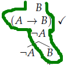
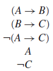
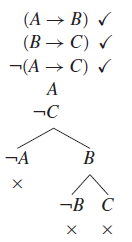
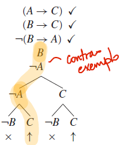
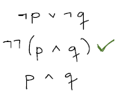
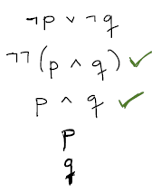
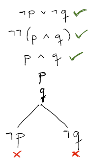

# Provando argumentos com árvores

Árvores podem ter muitas utilidades, dentro da mesma ideia de aumentar a eficiência da verificação das fórmulas. Deixa eu começar aqui com mais um uso interessante: **verificar se duas ou mais fórmulas são satisfazíveis se consideradas ao mesmo tempo**. Como diria Nietzsche, se são satisfazíveis juntas, imagina juntas!

Basta, para isso, usar, como raiz da árvore, duas fórmulas em vez de apenas uma. As regras são aplicadas do mesmo jeito, e continuamos a procurar literais complementares na hora de verificar. Se chegarmos a um nó-folha (ou caminho) aberto, quer dizer que considerar ambas as fórmulas como verdadeiras é satisfazível. Veja o exemplo abaixo, onde achamos um caminho aberto para satisfazer, ao mesmo tempo, B e A → B. Isso quer dizer que as duas fórmulas podem ser verdadeiras ao mesmo tempo, com a interpretação A=F e B=T (situação dada pelo próprio caminho).

A árvore sempre nos responde um mesmo tipo de pergunta: **se todas as proposições no topo da árvore podem ser verdadeiras em uma mesma interpretação**, ou seja, se o conjunto destas proposições é satisfazível. Por outro lado, uma árvore nunca pode nos responder, diretamente, se essas proposições são tautologias; ela é incapaz de responder se **uma proposição pode ser falsa**. 

Quero resgatar agora o conceito de **argumento**, trazendo-o pra esse mundo de árvores. Lembra, né, argumento, aquele conjunto de fórmulas com uma conclusão e zero ou mais premissas? Pois é, argumento é um conjunto de fórmulas. Conseguimos provar se um argumento é válido com a nossa amiga tabela-verdade, através do conceito de vinculação semântica (todas as premissas sendo verdadeiras em uma interpretação obriga a conclusão a ser verdadeira, sem isso o argumento é inválido). Resgatando um exemplo aqui: 

$A \rightarrow B, B \rightarrow C \models A \rightarrow C$

Será que a árvore pode nos ser útil na hora de provar um argumento como este, nos salvando da ineficiência da tabela-verdade? Pior que sim.

## Provas de argumentos com árvores

Não podemos pedir que uma árvore nos responda se o argumento é válido, diretamente, já que uma árvore não determina a falsidade de um conjunto de fórmulas, e sim apenas a possibilidade desse conjunto ser verdadeiro. Mesmo assim, dá pra resolver o argumento se refizermos a consulta: é possível serem **todas as premissas verdadeiras e a conclusão falsa**, ao mesmo tempo? Isso é exatamente o que precisamos verificar, alguma situação em que as premissas são verdadeiras e a conclusão é falsa. Como vimos na tabela-verdade, se tal situação ocorrer, é porque **o argumento não é válido**. Bingo! Assim, a nossa prova de validade de um argumento passa por encontrar uma árvore sem caminho aberto algum.

O método de prova de um argumento por árvore (ou tableaux, como vocês acham por aí em alguns livros) funciona criando uma árvore que vai verificar a satisfazibilidade do conjunto de fórmulas **{premissas + ¬conclusão}**. Tomando novamente o argumento acima, bem simples, e desenhando a árvore: 

Notem que já apliquei uma regra alfa, na negação da conclusão, gerando dois literais no caminho abaixo (A e ¬C). Podemos continuar aplicando as regras beta remanescentes para as duas premissas, o que nos gera a árvore final abaixo:

Olha aí! Todos os caminhos da raiz até as folhas estão fechados (em cada caminho há um par de literais complementares). Isso quer dizer, dentro do nosso método de prova, que o **argumento original é então válido**. Vejam agora um exemplo que modifiquei um pouco, só pra chegarmos em um resultado diferente.

$A → C, B → C \models B → A$

Fazendo a mesma coisa, com premissas e negação da conclusão; aqui aplicamos primeiro a regra alfa na negação da conclusão, então aplicamos regra beta em A→C antes de aplicar no final em B→C. Neste caso, aparecem dois caminhos abertos. Podemos considerar qualquer um deles para dizer que **o argumento é inválido**. O legal desse teste é que ele também fornece um **contraexemplo**; neste caso, qualquer caminho aberto encontrado.  No caminho aberto destacado na figura, vemos B e C aparecerem não-negados, enquanto A aparece negado, o que definem o nosso contraexemplo -- quando A é falso, e B e C são verdadeiros, nosso argumento cai por terra.

Notem, mais uma vez, o ganho potencial de desempenho. A tabela verdade para este argumento teria 8 soluções verificáveis (interpretações), mas só precisamos checar quatro delas (metade) pra **provar** que o argumento é inválido. 

Vamos terminar com um exemplo um pouco mais complicado, provando um dos corolários (hã?) das regras de De Morgan. 

$\neg p \vee \neg q \models \neg(p \wedge q)$

Começamos a árvore sempre da mesma forma: colocando premissas e conclusão negada na raiz. Já aplicamos de cara a regra alfa básica para eliminar a dupla negação da conclusão.

Em seguida, continuamos priorizando as regras alfa pra checar uma das premissas.

Então finalizamos com uma regra beta, que nos dá dois caminhos até os nós-folha, ambos fechados. O que isso significa, além do mundo receber a dádiva de  uma nova obra de arte neste belo exemplo artístico de caligrafia impecável? Argumento válido.

Agora, o que resta a vocês? Exercitar, verificar argumentos válidos e inválidos com este método.

