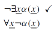
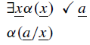
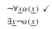

# Provas para Lógica de Predicados com Árvores

Com proposições, as árvores servem como meio eficiente de buscar a satisfação de uma (ou mais ao mesmo tempo) fórmula(s), através da procura sistemática por um modelo que satisfaça essa(s) fórmula(s). Não deve ser surpresa para você que, na lógica de predicados, pretendemos usar o tableaux com o mesmo objetivo. 

Para que isso seja possível, no entanto, precisaremos estender nossa caixa de ferramentas com regras de expansão da árvore na presença de **quantificadores** e de **igualdade**, que são os elementos novos por ora. Além disso, no momento de definir o modelo que faz a fórmula ficar verdadeira (ou falsa), precisaremos usar a ideia de modelo estendido da lógica de predicados.

## Árvores

A ideia básica para árvores se mantém: começamos definindo, na raiz, fórmulas, a partir das quais aplicamos **regras** expandindo a árvore. Ao assumir que uma determinada fórmula já escrita é verdadeira, o que escrevemos abaixo dela também é verdade. A árvore nos diz se as fórmulas colocadas na raiz podem ser todas verdadeiras juntas. Se for o caso, a árvore apresenta um cenário (modelo) em que elas são verdadeiras juntas, através de pelo menos um caminho aberto até as folhas.

Da mesma forma, se queremos testar se uma fórmula é válida, testamos se a negação da mesma na árvore não leva à satisfação, ou seja, todos os caminhos até as folhas fechados. 

As regras que usaremos serão as mesmas regras alfa e beta, conjuntivas e disjuntivas, respectivamente. Claro, teremos que aumentar esse conjunto, para podermos lidar com os quantificadores (para todo e existe), e também com a igualdade, os elementos novos adicionados na lógica de predicados. Teremos seis novas regras, duas para cada novo elemento; nenhuma delas criará desvios na árvore, como fazem as regras beta. Elas sempre criarão um novo filho apenas; teremos agora que tomar um certo cuidado para manipular as variáveis envolvidas nessas aplicações. Vamos começar com os existenciais.

### Quantificador Existencial

A primeira regra pra olhar -- por ser mais fácil -- é a tentativa de expandir uma negação de quantificador existencial. Eliminar negações é sempre bom para os objetivos da demonstração.

Aqui não tem muito o que pensar, pois estamos simplesmente dizendo que todos os elementos de um conjunto não possuem determinada propriedade, ao assumir que não há nenhum elemento desse conjunto com essa propriedade (considerando $\alpha(x)$ uma fórmula bem formada qualquer em que x é a única variável livre).

Vamos agora pra regra de quantificador existencial não-negado. Nesta, vale prestar atenção na manipulação de variáveis que precisamos fazer.

### Quantificador Universal

De forma similar, a regra mais fácil expande uma negação de quantificador universal para um quantificador existencial, passando a negação para a fórmula interna.

## Provas de argumentos com árvores
