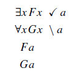
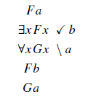
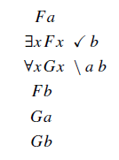
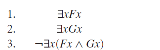
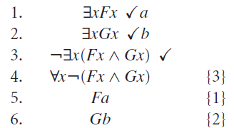
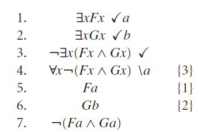
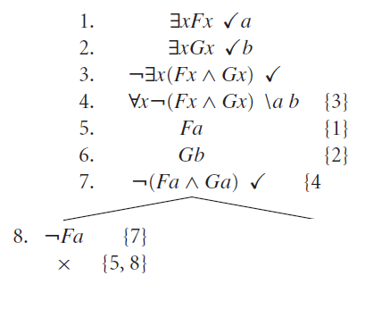
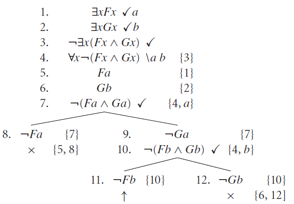

# Provas para Lógica de Predicados com Árvores

Com proposições, as árvores servem como meio eficiente de buscar a satisfação de uma ou mais fórmulas, através da procura sistemática por um modelo que satisfaça essa(s) fórmula(s). Não deve ser surpresa para você que, na lógica de predicados, pretendemos usar o tableaux com o mesmo objetivo. 

Para que isso seja possível, no entanto, precisaremos estender nossa caixa de ferramentas com regras de expansão da árvore na presença de **quantificadores** e de **igualdade**, que são os elementos novos por ora. Além disso, no momento de definir o modelo que faz a fórmula ficar verdadeira (ou falsa), precisaremos usar a ideia de modelo estendido da lógica de predicados.

## Árvores

A ideia básica para árvores se mantém: começamos definindo, na raiz, fórmulas, a partir das quais aplicamos **regras** expandindo a árvore. Ao assumir que uma determinada fórmula já escrita é verdadeira, o que escrevemos abaixo dela também é verdade. A árvore nos diz se as fórmulas colocadas na raiz podem ser todas verdadeiras juntas. Se for o caso, a árvore apresenta um cenário (modelo) em que elas são verdadeiras juntas, através de pelo menos um caminho aberto até as folhas.

Da mesma forma, se queremos testar se uma fórmula é válida, testamos se a negação da mesma na árvore não leva à satisfação, ou seja, todos os caminhos até as folhas fechados. 

As regras que usaremos serão as mesmas regras alfa e beta, conjuntivas e disjuntivas, respectivamente. Claro, teremos que aumentar esse conjunto, para podermos lidar com os quantificadores (para todo e existe), e também com a igualdade, os elementos novos adicionados na lógica de predicados. Teremos seis novas regras, duas para cada novo elemento; nenhuma delas criará desvios na árvore, como fazem as regras beta. Elas sempre criarão um novo filho apenas; teremos agora que tomar um certo cuidado para manipular as variáveis envolvidas nessas aplicações. 

Antes de falar sobre as novas regras, vamos tentar pensar sobre as regras na árvore de uma maneira geral, e assim deixar claro como vamos lidar com predicados. Se estamos aplicando uma regra no final de um caminho *p* -- considerando um caminho como uma sequência de fórmulas. Se estamos aplicando uma regra alfa, por exemplo, estendendo *p* para *p'*, adicionando uma nova fórmula no final da sequência, então a regra deve ter a seguinte propriedade:

> Se existe um modelo para o qual todas as fórmulas no caminho *p* são verdadeiras, então existe um modelo para o qual toda fórmula em *p'* é verdadeira.

Assim definimos satisfação na lógica de predicados, lembra? Tudo a ver com árvore, que testa justamente a satisfação de um conjunto de fórmulas. 

Vamos começar com os existenciais nas novas regras.

### Quantificador Existencial

A primeira regra pra olhar -- por ser mais fácil -- é a tentativa de expandir uma negação de quantificador existencial. Eliminar negações é sempre bom para os objetivos da demonstração.

Aqui não tem muito o que pensar, pois estamos simplesmente dizendo que todos os elementos de um conjunto não possuem determinada propriedade, ao assumir que não há nenhum elemento desse conjunto com essa propriedade (considerando $\alpha(x)$ uma fórmula bem formada qualquer em que x é a única variável livre).

Vamos agora pra regra de quantificador existencial não-negado. Nesta, vale prestar atenção na manipulação de variáveis que precisamos fazer.

Aqui estamos considerando um *a*zinho maroto, que consideramos como uma **nova constante** na árvore, um nome que não aparece em lugar algum no caminho atual. A convenção é indicar essa nova constante no lado direito, ao lado do *check*, facilitando a leitura. 

Tentando nos convencer de que a regra é correta de acordo com a nossa definição de árvore, suponha que temos um modelo *M* no qual $\exists x \alpha(x)$ é verdade. Assim, com certeza, esse modelo possui um elemento do conjunto considerado que faz $\alpha(a/x)$ ficar verdadeiro (considerando aqui a/x a constante tomando o lugar da variável x).

Vamos ver um exemplo, com uma fórmula no topo da árvore:

Até aqui ok. Falta aqui então tentar aplicar a regra novamente para $\exists x \neg F(x)$. E se fizermos isso aqui?

Assim a árvore resulta em uma fómrula insatisfazível, por causa da contradição. No entanto, o problema aqui é que a constante *a* já tinha sido usada, tornando essa aplicação de regra incorreta!  No contexto de uma regra beta, no entanto, podemos usar a mesma constante, no caso de caminhos alternativos. O exemplo abaixo é um desenvolvimento correto.

### Quantificador Universal

De forma similar, a regra mais fácil transforma uma negação de quantificador universal em um quantificador existencial, passando a negação para a fórmula interna.

No caso de quantificadores universais sem negação, temos que voltar ao conceito de introdução de variáveis, mas de forma um pouquinho diferente. Vamos usar aqui uma barra */* para indicar variáveis **arbitrárias**, ou seja, variáveis que possam representar **qualquer** elemento de um dado conjunto. 

Neste caso, podemos aplicar a mesma regra várias vezes, com variáveis diferentes, de acordo com a conveniência. O exemplo abaixo é um uso correto desta regra.

Ah, outra coisa, não tem problema se essa variável arbitrária já tiver sido usada antes no caminho. Lembrem-se que isso não acontecia com as constantes na regra do existencial; aqui não é constante, é variável arbitrária, uma representação de um conjunto de objetos.

## Heurística de aplicação das regras

Em geral, é conveniente aplicarmos as regras de árvore para a lógica de predicados na seguinte ordem:

1. regras proposicionais (alfa e beta), em geral regras alfa primeiro

2. regras de quantificador negado

3. regra para quantificador existencial

4. regra para quantificar universal

Depois disso, retorna para o primeiro passo, se for o caso. Essa heurística tende a gerar árvores menores, o que traz melhor desempenho para o algoritmo. Todas as regras usadas na árvore para lógica de predicados pode ser vista no Quadro abaixo.

Vamos ver um exemplo, para a fórmula $[\exists x F(x) \wedge \forall x(F(x) \rightarrow G(x))]\rightarrow \exists G(x)$. Queremos verificar se ela é válida, portanto vamos verificar se sua negação é insatisfazível. A partir dela, a primeira regra alfa separa os dois lados da negação da implicação.

Percebam que usamos aqui chaves do lado direito, para indicar a origem da fórmula atual. Para isso, é fundamental manter a numeração das linhas. Em seguida, aplicamos a regra alfa na conjunção da linha 2, finalizando o primeiro passo da heurística. Após isso, aplicamos as regras de quantificador negado (Linha 6). 

Vamos entender agora o que fazer agora. Temos um quantificador existencial na Linha 4, então o eliminamos usando a constante *a*. Como não há mais existenciais, podemos partir para o quantificador universal da Linha 5, resultando na Linha 8 abaixo.

A única fórmula a ser desenvolvida aqui é a implicação da Linha 8, o que fazemos com a aplicação da regra beta. No caminho da esquerda, a árvore se fecha pela presença do par $F(a)$  e $\neg F(a)$ — lembrando que F(a) equivale a uma proposição atômica qualquer, aplicando um predicado a uma constante, com resultado em uma valor lógico definido (verdadeiro ou falso). Já no caminho da direita, confrontamos $G(a)$ com o resultado da eliminação de quantificador que ainda sobrou, na Linha 6, que resulta em $\neg G(a)$. Note que, de forma bastante oportunista, usamos a mesma variável *a* que adotamos como constante lá em cima, o que é bastante conveniente, não acha?

Com todos os caminhos fechados, a fórmula original é então válida (uma tautologia).

## Saturação de caminhos

Antes de voltar a trabalhar com argumentos na árvore, temos que discutir mais sobre propriedades dessa árvore na presença de quantificadores, principalmente por causa dos elementos novos que precisam ser manipulados: constantes e variáveis.

Só podemos tirar conclusões sobre os caminhos de uma árvore quando ela for considerada **finalizada**, que se dá quando todos os caminhos estiverem fechados ou **saturados**. Um caminho saturado ocorre quando todas as regras aplicável foi usada.  Vamos para uma definição um pouco mais detalhada.

Um caminho está saturado se, e somente se:
* todas as fórmulas do caminho - exceto literais e quantificações universais - foram sujeitas a aplicação de regras;
* para todas as quantificações universais: a eliminação do quantificador foi aplicada pelo menos uma vez, além de ter sido aplicada para todas as variáveis que aparecem no caminho.

Exemplos, então. A árvore abaixo é considerada finalizada. Não há novas regras para aplicar para as fórmulas literais $F(a)$ e $G(a)$. Para $\forall x G(x)$, a regra foi aplicada uma vez, para todos os nomes de variável que aparecem (apenas $a$).

Já a árvore abaixo não está finalizada. 

Para isso, precisamos aplicar a regra universal novamente para $\forall x G(x)$, usando o nome $b$, já que ele ocorre no caminho. 

## Provas de argumentos com árvores

Vamos aos exemplos de argumentos com lógica de predicados, trabalhando na prova baseada em árvores da sua validade (ou contra-exemplo, no caso de argumentos inválidos). Vamos começar pelo seguinte argumento: 

$\exists F(x), \exists G(x)  \models \exists (F(x)\wedge G(x))$.

Tá meio estranho, né? se alguém é girafa, e também alguém bebe uísque, podemos concluir que existe uma girafa que bebe uísque? Pois é, jeito de argumento inválido, mas vamos provar isso. Na árvore, lembrando, colocamos as premissas junto com a negação da conclusão.

Podemos começar aplicando a regra da negação dos quantificadores, no caso da conclusão, gerando um quantificador universal. Depois, começamos eliminando os existenciais das Linhas 1 e 2 (lembrando que temos que usar constantes distintas). As linhas 5 e 6 são consideradas fórmulas literais.

Resta agora trabalhar com o quantificador universal da Linha 4, gerando a Linha 7. 

Opa, conjunção negada, regra beta! Vamos explorar o lado esquerdo primeiro, $\neg F(a)$, o que já de cara gera um caminho fechado.

Agora, o outro lado, com $\neg G(a)$. A princípio, com este literal, não há nada a fazer, pois não há o contrário dele no caminho. No entanto, percebemos que o caminho aqui não está *saturado*...a constante $b$ não foi usada para eliminar a quantificação da linha 4! Se fizermos isso, geramos a Linha 10, que vai nos levar a outra regra beta aplicada. Quando isso acontecer, chegaremos a um caminho terminando em $\neg F(b)$, literal que não encontra contraditório acima. Portanto, esse é um caminho aberto, pois agora a árvore está saturada. O que nos leva a concluir que o argumento original era mesmo *inválido*.

Já que o argumento não é válido, podemos tentar usar a árvore para achar o contra-exemplo, o caso que mostra o argumento deixando de valer. Na lógica proposicional, tínhamos que achar valores (T,F) para as variáveis da fórmula (uma interpretação). Aqui, só podemos fazer isso através de *modelos*, ou seja, uma definição de conjuntos e predicados.

Lembrando do tópico anterior, para definir um modelo precisamos de um conjunto universo (o domínio) e de definições, a partir desse conjunto universo, para cada predicado e constante. Temos liberdade para definir qualquer conjunto universo, contanto que os nomes que criamos na árvore apareçam nesse conjunto. De forma minimalista, podemos começar com **apenas as constantes da árvore**. 

$U = {a,b}$

Para os predicados, podemos definir os conjuntos que obedecem às fórmulas literais que aparecem no caminho que ficou aberto. Pela árvore, sabemos que $F(a),G(b),\neg G(a), \neg F(b)$; assim, fica simples definir, para os predicados, os seguintes conjuntos: $F={a}$ e $G={b}$. Confira você se um modelo minimalista como esse não faz as premissas verdadeiras e a conclusão falsa! É só considerar $a$ sendo uma girafa, e $b$ uma pessoa que toma uísque.

